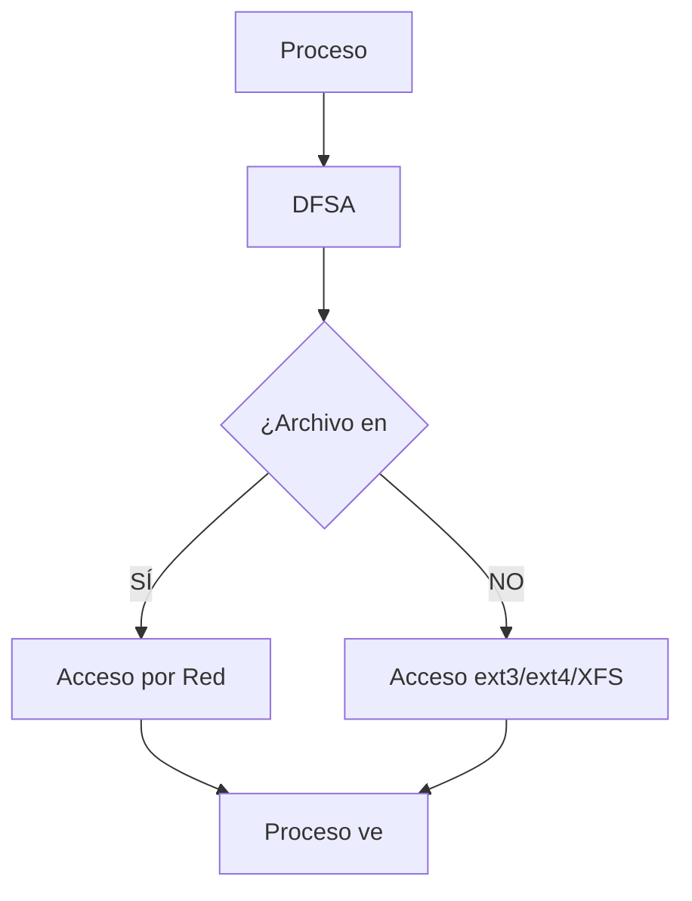

# slide-08-explicacion.md — Sistema de Archivos MOSIX

## Introducción

Esta slide presenta el **Sistema de Archivos de MOSIX**, focalizándose en el mecanismo **DFSA (Distributed File System Adapter)** que permite el acceso transparente a archivos en un cluster MOSIX. La slide muestra tres componentes principales: el flujo de interceptación DFSA (lado izquierdo), los sistemas de archivos locales soportados por cada nodo (lado derecho superior), y las limitaciones del enfoque adoptado por MOSIX (lado derecho inferior).

El diseño de MOSIX respecto al almacenamiento es deliberadamente pragmático: en lugar de crear un sistema de archivos distribuido propio, implementa una capa de interposición sobre syscalls que redirige las operaciones de E/S hacia el nodo donde residen físicamente los datos. Este enfoque tiene ventajas e inconvenientes que se analizan en detalle a continuación.

---

## 1. DFSA — Distributed File System Adapter

### 1.1 Definición y Propósito

**DFSA (Distributed File System Adapter)** es el mecanismo mediante el cual MOSIX permite que un proceso migrado realice operaciones sobre archivos **directamente en el nodo actual de ejecución**, sin necesidad de retornar al nodo donde se inició el proceso para cada operación de E/S. El término "Adapter" en su nombre indica que actúa como un puente entre las syscalls de archivo generadas por las aplicaciones y los sistemas de archivos locales existentes en cada nodo del cluster.

El propósito fundamental de DFSA es proporcionar **transparencia de ubicación**: las aplicaciones perciben las operaciones de archivo como si fueran locales, independientemente de dónde esté almacenado el archivo físico en el cluster. Esta transparencia es crítica para que la migración de procesos funcione correctamente — un proceso migrado puede abrir, leer, escribir y cerrar archivos sin conocer la topología de almacenamiento del cluster.

### 1.2 Cómo Funciona la Interceptación de Syscalls

La interceptación de syscalls es el mecanismo técnico central de DFSA. A nivel conceptual, el flujo opera de la siguiente manera:

**Paso 1 — Generación de syscall**: Un proceso en ejecución (posiblemente migrado desde otro nodo) invoca una llamada al sistema relacionada con archivos, como `open()`, `read()`, `write()`, `close()`, `mkdir()`, `unlink()`, o cualquier otra syscall del sistema de archivos definida en §1.7 del temario FSO ("Llamadas al Sistema: Procesos: fork(), exec(), exit(); Archivos: open(), read(), write(), close(); Directorios: mkdir(), rmdir()").

**Paso 2 — Interceptación por DFSA**: Antes de que la syscall llegue al sistema de archivos local del nodo actual, DFSA la intercepta. Esta intercepción ocurre a nivel del kernel Linux sobre el cual corre MOSIX. DFSA examina la operación solicitada y determina si el archivo destino está almacenado en el nodo actual o en otro nodo del cluster.

**Paso 3 — Determinación de ubicación**: DFSA mantiene o consulta información sobre la ubicación de cada archivo en el cluster. Si el archivo está en el nodo actual, la operación se ejecuta localmente. Si el archivo está en otro nodo (por ejemplo, Nodo B cuando el proceso está ejecutándose en Nodo A), DFSA prepara una redirección.

**Paso 4 — Redirección de E/S**: La operación de E/S se redirige hacia el nodo que contiene el archivo. Esto típicamente implica comunicación de red entre nodos. El resultado de la operación se retorna al proceso como si hubiera sido ejecutada localmente.

**Paso 5 — Retorno transparente**: El proceso usuario recibe el resultado de la syscall sin ninguna indicación de que el archivo estuviera en otro nodo. Los valores de retorno (descriptores de archivo, bytes leídos/escritos, códigos de error) son idénticos a los que se habrían obtenido en una operación puramente local.

El flujo completo de interceptación DFSA se Resume en el siguiente diagrama:

### 1.3 Transparencia de Ubicación en el Cluster

La **transparencia de ubicación** es un concepto fundamental en sistemas distribuidos que DFSA implementa. Según el temario FSO §1.1, un sistema operativo puede verse como una "máquina extendida" que oculta complejidad del hardware presentando una interfaz más simple. DFSA extiende este concepto al dominio distribuido: el cluster entero se presenta a las aplicaciones como un único sistema de archivos local.

Esta transparencia tiene implicaciones prácticas importantes:

- **Las aplicaciones no necesitan modificar su código** para ejecutarse en un cluster MOSIX. Un programa que usa `open("/home/user/data.txt", O_RDONLY)` funcionará indistintamente si el archivo está en el nodo donde se inició el proceso o en cualquier otro nodo del cluster.

- **La migración de procesos es transparente respecto a archivos**: cuando MOSIX migra un proceso por balanceo de carga, el proceso puede continuar usando sus archivos abiertos sin interrupciones. DFSA redirige automáticamente las operaciones al nodo correspondiente.

- **El modelo de nombres es uniforme**: los archivos se referencian por su ruta absoluta o relativa, sin prefijos especiales que indiquen el nodo de almacenamiento. Esto contrasta con otros sistemas distribuidos donde se requieren convenciones como `/nodo1/fs/...` o direcciones explícitas de red.

### 1.4 Relación con §3.1 del Temario FSO

La sección §3.1 del temario distingue entre **Sistema de Archivos en sentido amplio** (todo el software de gestión de archivos + estructuras de datos + servicios) y **sentido estricto** (solo la estructura de datos en disco: i-nodos, FAT, etc.). DFSA es un ejemplo de sistema de archivos en sentido amplio: no proporciona una estructura de datos en disco propia, sino que actúa como una capa inteligente de interposición sobre los sistemas de archivos existentes.

En términos de §3.1, MOSIX con DFSA implementa un "sistema de archivos en sentido amplio" distribuido que:
- **Gestiona el acceso a archivos** a través del cluster mediante interceptación de syscalls
- **Utiliza estructuras de datos existentes** (i-nodos de ext3/ext4/XFS) en cada nodo individual
- **Proporciona servicios de transparencia** que van más allá de lo que un FS local ofrecería

DFSA no reemplaza los i-nodos ni las estructuras de datos de los FS subyacentes; trabaja por encima de ellos, añadiendo una capa de red y ubicación.

---

## 2. Sistemas de Archivos Locales por Nodo

### 2.1 Filosofia de Diseño

MOSIX no proporciona su propio sistema de archivos distribuido. En cambio, cada nodo del cluster utiliza su **sistema de archivos local** sin modificaciones. Esta decisión de diseño es pragmática y tiene varias ventajas:

**Compatibilidad con estándares**: Al usar sistemas de archivos Linux maduros y probados (ext3, ext4, XFS), MOSIX se beneficia de décadas de desarrollo, depuración y optimización que estos sistemas de archivos han recibido. No es necesario reinventar la gestión de bloques, i-nodos, journaling, o caché de archivos.

**Simplicidad de implementación**: Crear un sistema de archivos distribuido desde cero es una tarea extremadamente compleja que requiere resolver problemas difíciles de consistencia, coherencia de caché, distribución de metadatos, y recuperación ante fallos. Al delegar estas responsabilidades a los FS locales, MOSIX puede concentrar su desarrollo en su fortaleza: la migración de procesos y el balanceo de carga.

**Enfoque en migración de procesos**: La energía de desarrollo de MOSIX se concentra en el balanceo de carga y la migración de procesos, no en almacenamiento. Esta especialización es coherente con el propósito principal del cluster MOSIX: agregar potencia de cálculo distribuida.

**Escalabilidad limitada por diseño**: Al no tener un FS propio, MOSIX evita automáticamente los problemas de consistencia distribuidos. No necesita un servidor de metadatos centralizado ni protocolos de coherencia entre nodos. Esta simplicidad tiene un costo: las capacidades de E/S son limitadas comparadas con Parallel FS dedicados.

### 2.2 Sistemas de Archivos Soportados

La slide enumera cinco tipos de sistemas de archivos compatibles con MOSIX:

| Sistema de Archivos | Tipo | Descripción |
|--------------------|------|-------------|
| **ext3** | Journaling | Tercera extensión de ext2, añade journaling (registro de transacciones) para recuperación rápida ante fallos. Muy utilizado en Linux servidor. |
| **ext4** | Journaling | Evolución de ext3, soporta volúmenes de hasta 1 exabyte, extent-based allocation para mejor rendimiento, menos fragmentación. Es el FS Linux más común actualmente. |
| **XFS** | Journaling de alto rendimiento | Diseñado para sistemas de archivos grandes y alto rendimiento en E/S. Utilizado en supercomputadoras y centros de datos. Soporta配额es y snapshots nativas. |
| **NFS** | Network File System | Protocolo de archivos en red que permite montar sistemas de archivos remotos. MOSIX lo soporta para acceder a archivos exportados por otros nodos o servidores externos. |
| **ext2** | Legacy | Segunda extensión, sin journaling. Histórico, usado en memorias USB y situaciones donde no se necesita журналирование. Todavía funcional pero no recomendado para producción. |

Todos estos sistemas de archivos tienen en común que usan **i-nodos** para almacenar metadatos de archivos, lo cual es relevante para §3.6 del temario (métodos de asignación de espacio). ext3, ext4 y XFS usan variantes del método de **i-nodos** (bloques índice con punteros directos e indirectos), no FAT ni asignación contigua.

### 2.3 Relación con §3.6 del Temario FSO

La sección §3.6 del temario describe los métodos de asignación de espacio:

- **Contiguo**: Bloques físicos adyacentes — causa fragmentación externa
- **Enlazado**: Bloques con punteros al siguiente — ninguna fragmentación externa pero ineficiente para acceso directo
- **FAT**: Tabla en memoria con cadena de bloques — intermedia
- **I-nodos**: Bloque índice con punteros directos/indirectos — ninguna fragmentación externa, acceso directo eficiente

Los FS subyacentes en MOSIX (ext3, ext4, XFS) usan el método de **i-nodos**. Cada archivo tiene un i-nodo que contiene:
- Metadatos (permisos, timestamps, propietario, tamaño)
- Punteros a los bloques de datos (directos e indirectos)

Esta implementación es relevante porque DFSA no modifica la estructura interna de los archivos: cada archivo reside completamente en un solo nodo, dentro del sistema de archivos local de ese nodo. No hay striping de datos entre nodos — un archivo no se divide en fragmentos almacenados en múltiples nodos.

### 2.4 Interacción entre DFSA y los FS Locales

Cuando un proceso migrado ejecuta una syscall como `read(fd, buffer, count)`:

1. **DFSA intercepta** la llamada antes de que llegue al FS local
2. **Determina el nodo** donde reside el archivo asociado al descriptor `fd`
3. **Si el archivo está en el nodo actual**, delega directamente al FS local (ext3/ext4/XFS)
4. **Si el archivo está en otro nodo**, envía la solicitud de lectura a través de la red al nodo que posee el archivo
5. **El nodo remoto** ejecuta la lectura usando su FS local y devuelve los datos
6. **DFSA local** recibe los datos y los retorna al proceso como si hubieran sido leídos localmente

Este flujo es completamente transparente para la aplicación. El descriptor de archivo `fd` retornado por `open()` se comporta igual whether el archivo está local o remotamente.

---

## 3. Limitaciones del Sistema de Archivos de MOSIX

### 3.1 No es un Parallel Filesystem

La limitación más significativa es que **MOSIX no es un Parallel FS** como PVFS, Lustre o GFS/GPFS. Esta distinción es fundamental para entender las capacidades y limitaciones del sistema.

Un **Parallel Filesystem** (sistema de archivos paralelo) tiene estas características:
- **Datos distribuidos**: Los archivos se distribuyen (striping) entre múltiples nodos de almacenamiento
- **Acceso paralelo**: Múltiples nodos pueden leer/escribir partes del mismo archivo simultáneamente
- **Alto rendimiento**: Diseñado para cargas de trabajo con alta E/S paralela
- **Escalabilidad horizontal**: Agrega capacidad de almacenamiento y ancho de banda de E/S al agregar nodos

MOSIX con DFSA **no tiene ninguna de estas características**:
- **Almacenamiento local**: Cada nodo tiene su propio almacenamiento local, no hay almacenamiento distribuido compartido
- **Un solo nodo por archivo**: Cada archivo reside íntegramente en un solo nodo, sin striping
- **Acceso secuencial por nodo**: Solo el nodo que posee el archivo puede accederlo, no hay acceso paralelo multi-nodo al mismo archivo
- **Rendimiento limitado**: El rendimiento de E/S está limitado por las capacidades del nodo individual y la latencia de red para archivos remotos

### 3.2 Latencia de Red como Cuello de Botella

Cuando un proceso migrado necesita acceder a un archivo ubicado en otro nodo, la operación de E/S incurre en **latencia de red adicional**. Esta latencia es unavoidable en el diseño de DFSA:

- Una operación de lectura local puede completarse en microsegundos (acceso a memoria caché del sistema de archivos)
- Una operación de lectura remota requiere como mínimo: envío de solicitud por red al nodo remoto (~0.1-1 ms en LAN), ejecución de la lectura por el FS local del nodo remoto, transmisión de datos de vuelta (~0.1-1 ms), y entrega al proceso

La documentación oficial de MOSIX advierte explícitamente: *"The access to files can become a bottleneck when there is a lot of I/O"*. Esto es particularmente problemático para:
- Aplicaciones con patrones de acceso a archivos intensivo (E/S bound)
- Bases de datos con archivos de datos grandes
- Aplicaciones de HPC que requieren alto ancho de banda de E/S

### 3.3 Sin Paralelismo de E/S

Los Parallel FS modernos como **Lustre** y **GPFS** están diseñados específicamente para cargas de trabajo de computación de alto rendimiento (HPC) donde el paralelismo de E/S es crítico:

- **Lustre** (usado en >60% de supercomputadoras Top500) puede escala a miles de nodos de almacenamiento, con múltiples OST (Object Storage Targets) sirviendo archivos en paralelo
- **GPFS/IBM Spectrum Scale** permite que múltiples nodos escriban simultáneamente al mismo archivo con coordinación de coherencia

MOSIX DFSA no proporciona paralelismo de E/S. Si un archivo está en el Nodo A, todas las operaciones sobre ese archivo pasan por el Nodo A, sin importar cuántos otros nodos estén disponibles. Esto contrasta marcadamente con Parallel FS donde un archivo de 100 GB podría ser stripeed across 10 nodos, permitiendo 10 streams de E/S simultáneos.

### 3.4 Sin Soporte para Shared Memory entre Procesos

MOSIX no soporta **memoria compartida distribuida (DSM — Distributed Shared Memory)** entre procesos. Esta limitación tiene impacto directo en el diseño de aplicaciones paralelas:

- Aplicaciones que usarían un FS distribuido para implementar comunicación entre procesos (por ejemplo, escribir en un archivo compartido que otro proceso lee) no funcionarán de manera eficiente
- No hay capacidad de crear segmentos de memoria compartida que abarquen múltiples nodos
- Las aplicaciones que requieren modelos de programación paralelos con memoria compartida distribuida necesitan soluciones adicionales (como OpenMP con un backend de memoria compartida distribuida, o PGAS languages)

### 3.5 Relación con §3.8 del Temario FSO

La sección §3.8 del temario describe los tipos de enlaces en sistemas de archivos:

- **Hard link**: Múltiples nombres que apuntan al mismo i-nodo (mismo archivo físico)
- **Soft/Symbolic link**: Archivo especial que contiene una ruta al archivo destino

En el contexto de MOSIX, estas limitaciones de enlaces se manifiestan así:

- **No hay enlaces entre nodos**: No es posible crear un hard link en el Nodo A que apunte a un archivo en el Nodo B. Los enlaces están limitados al ámbito del sistema de archivos local de cada nodo.
- **Cada nodo gestiona sus propios archivos**: Un archivo existe completamente dentro de un solo sistema de archivos. No hay forma de crear un enlace simbólico que atraviese nodos (/nodo-b/file -> /nodo-a/file).

Esta limitación refuerza que MOSIX no proporciona un sistema de archivos verdaderamente distribuido en el sentido de ofrecer un espacio de nombres unificado con semántica de archivos compartidos entre nodos.

---

## 4. Glosario de Términos

### DFSA — Distributed File System Adapter
**Definición**: Capa de interposición de MOSIX que intercepta syscalls de archivo y redirige las operaciones al nodo del cluster donde reside físicamente el archivo. Proporciona transparencia de ubicación sin modificar los sistemas de archivos subyacentes.

**Sigla de**: Distributed File System Adapter

**Contexto en la slide**: DFSA es el centro del diagrama de interception flow, representando el componente que intercepta syscalls de archivos y redirige según la ubicación del archivo.

---

### Syscall Interception (Interceptación de Llamadas al Sistema)
**Definición**: Técnica mediante la cual un componente del sistema operativo captura las llamadas al sistema emitidas por los procesos de usuario antes de que lleguen al manejador final. En MOSIX, DFSA intercepta syscalls de archivo (open, read, write, close, etc.) para añadir lógica de distribución.

**Contexto técnico**: En Linux, las syscalls se invocan mediante la instrucción `syscall` (en CPUs modernos) o `int 0x80` (en CPUs más antiguos). MOSIX inserta su propia lógica entre la invocación de la syscall y la ejecución del manejador nativo del kernel.

**Relación con temario**: §1.7 define syscalls como parte del modelo de modo dual de operación: "Usuario → (system call / interrupción) → Kernel". La interceptación ocurre en este punto de transición.

---

### Distributed Filesystem (Sistema de Archivos Distribuido)
**Definición**: Sistema de archivos que abstrae múltiples servidores de almacenamiento como un único sistema de archivos coherente. Los archivos pueden residir en diferentes nodos y se accede a ellos a través de una interfaz de archivos estándar (típicamente POSIX).

**Características distintivas**:
- Espacio de nombres unificado (una ruta refiere al mismo archivo desde cualquier nodo)
- Transparencia de ubicación (el usuario no necesita saber dónde está el archivo)
- Compartición de archivos entre múltiples nodos
- Coherencia de datos (importante para escritura concurrente)

**Ejemplos**: NFS (Network File System), SMB/CIFS, GFS, OCFS

**MOSIX vs Distributed Filesystem**: DFSA proporciona algunas características de un DFS (transparencia de ubicación, acceso desde cualquier nodo) pero no proporciona compartición efectiva de archivos entre nodos (cada archivo reside en un solo nodo) ni coherencia de escritura distribuida.

---

### NFS — Network File System
**Definición**: Protocolo de archivos en red desarrollado originalmente por Sun Microsystems que permite que un cliente monte un sistema de archivos remoto como si fuera local. Es un estándar en entornos UNIX/Linux para compartir archivos entre máquinas.

**Versión actual**: NFSv4 (RFC 3530) con soporte para autenticación Kerberos, operaciones stateful, y mejor rendimiento en WAN.

**En MOSIX**: NFS aparece como uno de los sistemas de archivos soportados por DFSA, lo que significa que MOSIX puede redirigir operaciones a través de NFS cuando el archivo destino está exportado por un servidor NFS remoto. Esto permite escenarios donde los archivos se comparten entre nodos mediante NFS export tradicional, complementando la funcionalidad de DFSA.

**Limitaciones en contexto MOSIX**: NFS introduce latencia adicional de red y tiene limitaciones de escalabilidad comparadas con Parallel FS modernos. Si el servidor NFS es un cuello de botella, todo el cluster lo siente.

---

### Parallel Filesystem (Sistema de Archivos Paralelo)
**Definición**: Sistema de archivos diseñado para clusters de alto rendimiento donde los datos se distribuyen (striping) entre múltiples nodos de almacenamiento y múltiples clientes pueden acceder al mismo archivo o diferentes partes de un archivo en paralelo.

**Características**:
- **Striping de datos**: Un archivo se divide en fragmentos (stripes) almacenados en múltiples OST (Object Storage Targets)
- **acceso paralelo multi-nodo**: Múltiples nodos pueden leer/escribir simultáneamente diferentes partes del mismo archivo
- **Ancho de banda agregable**: El ancho de banda de E/S escala con el número de nodos de almacenamiento
- **Servidor de metadatos**: Típicamente hay un MDS (Metadata Server) que gestiona la ubicación de los datos

**Ejemplos prominentes**:
- **Lustre**: Open source, mantenido por Intel/DDN, usado en >60% de Top500
- **GPFS/IBM Spectrum Scale**: Propietario IBM, usado en Summit y Sierra
- **WekaIO**: Commercial, optimizado para AI/ML workloads
- **BeeGFS**: Open source, popular en entornos de investigación

**PVFS (Parallel Virtual File System)**: Antecesor de muchos Parallel FS modernos, desarrollado por University of Chicago y Argonne National Laboratory. Estado: proyecto discontinuado (~2011).

**MOSIX vs Parallel Filesystem**: MOSIX DFSA no es ni aspira a ser un Parallel FS. Su diseño está orientado a la migración de procesos, no al rendimiento de E/S paralelo. Esta distinción es explícitamente noted en las limitaciones de la slide.

---

## 5. Nota Académica — Conexión con Temario FSO

La nota al pie de la slide indica: *"DFSA cómo capa de interposición sobre syscalls (§3.1) — ausencia de parallel FS contrasta con sistemas de archivos distribuidos modernos (§3.6)"*. Esta nota sintetiza varios conceptos del temario:

### §3.1 — Sistema de Archivos en Sentido Amplio vs Estricto
DFSA es un ejemplo de **sistema de archivos en sentido amplio**: no consiste solo en estructuras de datos en disco (sentido estricto), sino que incluye software de gestión, servicios de red, y lógica de transparencia que opera sobre los FS locales existentes. Esta distinción es importante para entender que MOSIX no compite con ext4 o XFS como FS de disco — DFSA trabaja _sobre_ ellos, no en lugar de ellos.

### §3.6 — Métodos de Asignación de Espacio
La ausencia de striping en MOSIX significa que no hay distribución de bloques de un archivo entre múltiples nodos. Cada archivo reside completamente dentro del sistema de archivos local de un solo nodo. Esta decisión de diseño simplifica la arquitectura pero limita el rendimiento de E/S. Los Parallel FS modernos usan striping precisamente para evitar este cuello de botella.

### §3.8 — Enlaces
Las limitaciones de enlaces entre nodos en MOSIX refuerzan que no hay un espacio de nombres de archivos compartido entre nodos. Cada nodo tiene su propia jerarquía de directorios, y DFSA solo proporciona acceso _transparente_ a archivos remote, no compartición real de archivos con semántica de enlaces.

---

## 6. Resumen Técnico

| Aspecto | Detalle |
|---------|---------|
| **¿FS propio distribuido?** | No — MOSIX usa DFSA como capa de interposición |
| **Mecanismo principal** | DFSA intercepta syscalls de archivo y redirige al nodo correspondiente |
| **FS subyacentes soportados** | ext3, ext4, XFS, NFS, ext2 (todos usan i-nodos) |
| **¿Parallel FS?** | No — sin striping, sin paralelismo de E/S |
| **¿Shared memory via FS?** | No soportado |
| **Cuellos de botella** | Latencia de red para archivos remotos, sin paralelismo de E/S |
| **Transparencia de ubicación** | Sí — las aplicaciones ven operaciones locales aunque el archivo esté en otro nodo |

---

## 7. Fuentes y Referencias

La información de esta explicación proviene de:

- **sistema-de-archivos-mosix.md** (`informacion/B-Puertas-Adentro/`) — Documento principal con información técnica sobre DFSA y limitaciones
- **temario_FSO.md** — Temario de Fundamentos de Sistemas Operativos para conexiones con §3.1, §3.6, §3.8
- **The MOSIX Direct File System Access Method for Supporting Scalable Cluster File Systems** (ResearchGate) — Publicación académica sobre DFSA
- **MOSIX Scalable Cluster File Systems for LINUX** (Academia.edu) — Descripción técnica del sistema
- **VAST Data: Parallel vs Distributed File Systems for HPC Storage** — Contexto sobre Parallel FS modernos
- **USENIX: Comparative Experimental Study of Parallel File Systems** — Comparativa de rendimiento entre Parallel FS
