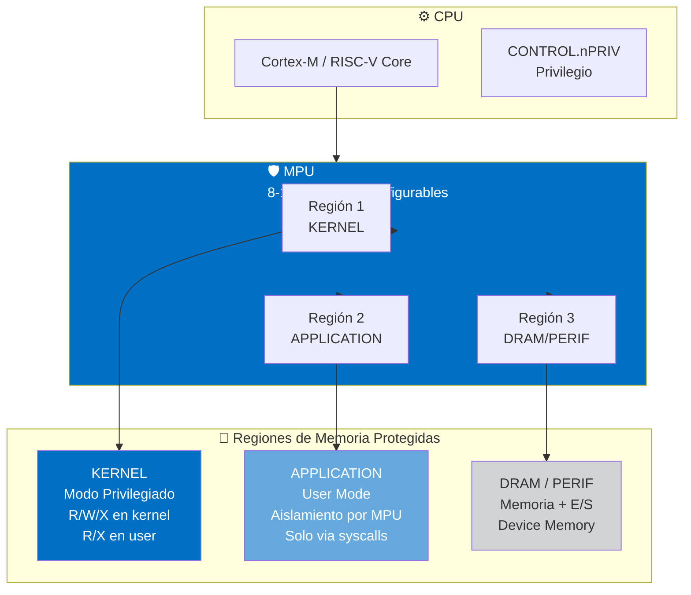

# Explicación slide-09: Administración de Memoria Zephyr OS

> **Slide**: 9 — Zephyr OS — Administración de Memoria
> **Fuente académica**: Fundamentos de Sistemas Operativos — UNMDP
> **Referencias cruzadas**: §4.1, §4.4, §4.5, §5.1, §5.2, §5.3, §5.6

---

## 1. Introducción y Contexto

Zephyr OS es un RTOS (Real-Time Operating System) diseñado específicamente para **microcontroladores (MCUs)** con recursos limitados: típicamente entre 8 KB y 512 KB de SRAM, y hasta 2 MB de flash. Esta restricción de hardware define completamente su modelo de administración de memoria, que difiere radicalmente de los sistemas operativos de escritorio como Linux o Windows.

La slide muestra que Zephyr utiliza **MPU-based protection** en lugar de MMU para la mayoría de sus configuraciones. Esto significa que Zephyr prioriza la **protección** sobre la **virtualización** de memoria. Mientras que un sistema con MMU puede implementar memoria virtual completa (paginación, swapping, address spaces aislados), un sistema con MPU solo puede definir regiones de memoria con permisos específicos, sin capacidad de traducciones de direcciones virtuales a físicas.

---

## 2. MPU vs MMU: Abordajes Complementarios para Objetivos Distintos

### 2.1 MPU (Memory Protection Unit)

La **MPU** es una unidad de hardware presente en la mayoría de microcontroladores ARM Cortex-M, RISC-V embebido, y otras arquitecturas para sistemas embebidos. Su función es **restringir accesos a memoria** mediante la configuración de regiones discretas.

**Características de la MPU:**

- **Regiones configurables**: Típicamente 8 a 16 regiones (dependiendo del SoC)
- **Atributos por región**: permisos de lectura (R), escritura (W), ejecución (X)
- **Dirección base + tamaño**: Cada región se define por una dirección inicial y un tamaño potencia de 2
- **Hardware enforcement**: Cualquier acceso fuera de región o sin permisos genera una excepción (HardFault, MemManage fault)
- **Sin traducción de direcciones**: No existe mapeo virtual→físico; la dirección usada es la dirección física

**Modelo conceptual**:
```
CPU (dirección virtual = dirección física) → MPU verifica → Acceso a memoria física
```

### 2.2 MMU (Memory Management Unit)

La **MMU** es una unidad de hardware presente en procesadores más complejos (ARM Cortex-A, x86, RISC-V application-class) capaz de traducción de direcciones y virtualización de memoria.

**Características de la MMU:**

- **Tablas de páginas**: Estructuras jerárquicas que mapean direcciones virtuales a físicas
- **Paginación**: Memoria dividida en páginas (típicamente 4KB) y frames de página
- **Virtualización completa**: Cada proceso puede tener su propio address space aislado
- **Demand paging**: Cargar páginas desde disco bajo demanda
- **Protección + Aislamiento**: Además de traducción, provee aislamiento entre procesos

**Modelo conceptual**:
```
CPU (dirección virtual) → MMU traduce via page tables → Memoria física (puede estar en RAM o disco)
```

### 2.3 ¿Por qué Zephyr usa MPU en lugar de MMU?

La elección de MPU sobre MMU en Zephyr responde a restricciones de hardware y filosofía de diseño:

| Factor | MPU | MMU |
|--------|-----|-----|
| **Hardware objetivo** | Microcontroladores (Cortex-M0/M3/M4, RISC-V embedded) | Aplicaciones (Cortex-A, x86, RISC-V app-class) |
| **Consumo de energía** | Muy bajo | Mayor |
| **Área de silicio** | ~0.1 mm² | ~1-5 mm² |
| **Costo** | Incluido en casi todo MCU | Solo en SoCs más costosos |
| **Complejidad de software** | Baja | Alta (page tables, TLB, context switches) |
| **Capacidad de virtualización** | Solo protección | Protección + virtualización |

Zephyr está diseñado para sistemas donde el costo, consumo de energía y determinismo temporal son críticos. Un RTOS para MCUs no necesita ejecutar docenas de procesos simultáneamente con address spaces aislados; necesita garantizar que un bug en una tarea no corrompa la memoria del kernel o de otras tareas.

**Conexión con temario FSO §4.4**: La paginación describe el mecanismo de memoria virtual donde la memoria lógica se divide en páginas y la física en frames. La MPU **no implementa paginación**; trabaja con regiones de direcciones físicas contiguas. Esto es conceptualmente más cercano a las particiones fijas de MFT (§4.2) que a la paginación, aunque con granularidad mucho más fina y sin fragmentación interna porque las regiones se configuran según necesidad.

---

## 3. Regiones de Memoria en Zephyr

El diagrama de la slide presenta tres regiones fundamentales del mapa de memoria de Zephyr, organizadas según el modelo de protección por hardware.



### 3.1 Región KERNEL (Modo Privilegiado)

Esta región contiene el código del kernel de Zephyr y se ejecuta en el nivel de privilegio más alto del procesador.

**Componentes**:

- **.text**: Código ejecutable del kernel, rutinas de scheduling, manejo de interrupciones
- **.rodata**: Datos de solo lectura del kernel (constantes, tablas de跳转)
- **.data / .bss**: Variables globales inicializadas y no inicializadas del kernel
- **Stack del sistema**: Stack usado durante inicialización y en interrupciones

**Permisos en MPU**:

- **Lectura + Escritura + Ejecución** en kernel mode
- **Lectura + Ejecución** en user mode (sin escritura para proteger integridad)
- Sin acceso desde DMA de periféricos no autorizados

**Conexión con §1.5 (Modo Dual)**: El modo privilegiado del kernel corresponde al "modo Kernel" del temario, donde las instrucciones privilegiadas están disponibles y el acceso a todo el hardware es completo.

### 3.2 Región APPLICATION (User Mode)

Esta región contiene las aplicaciones de usuario que se ejecutan con privilegios restringidos. Zephyr implementa un modelo de **user mode** donde las aplicaciones:

- Se ejecutan en un nivel de privilegio inferior
- No pueden acceder directamente a hardware ni a memoria del kernel
- Solo pueden interactuar con el kernel mediante system calls

**Características**:

- **Aislamiento por hardware**: La MPU programa una región dedicada para cada thread con su stack y datos
- **Memory Domains**: Grupos de particiones de memoria que definen qué regiones puede acceder una aplicación
- **Stack protection**: Overflow del stack de usuario genera una excepción MPU

**Stack Overflow Protection**: Zephyr puede insertar "guard pages" antes y después del stack buffer. Si el stack crece más allá de su límite, la MPU detecta el acceso a la página guard y genera una excepción, evitando corrupción de memoria adyacente.

### 3.3 Región DRAM / PERIFÉRICOS

Esta región incluye dos categorías diferentes de recursos de hardware:

**DRAM (Dynamic RAM)**:

- Memoria principal del sistema para datosheap, stacks de threads, buffers
- En sistemas sin MMU, es mapeada 1:1 (dirección virtual = física)

**Periféricos (E/S mapeada a memoria)**:

- Dispositivos de hardware con registros accesibles via direcciones de memoria
- Incluye timers, UARTs, SPI controllers, GPIO controllers, etc.
- Requieren acceso "Device" (orden de accesos, no optimizable por caché)

**Atributos de memoria típicos**:

| Tipo | Caché | Write Buffer | Descripción |
|------|-------|--------------|-------------|
| **Normal** | RW | Yes | DRAM, SRAM (datos/texto) |
| **Device** | None | No | Periféricos |
| **Strongly-ordered** | None | No | Registros críticos |

**Conexión con §4.1**: La administración de memoria en Zephyr debe gestionar la competencia por recursos limitados entre múltiples threads. A diferencia de un SO de escritorio donde la memoria virtual permite "crear" más memoria, en Zephyr la memoria física es exactamente la disponible; el trabajo del SO es maximizar su utilización eficiente y garantizar aislamiento.

---

## 4. Asignación de Memoria en Zephyr

### 4.1 Heap (Asignación Dinámica Clásica)

Zephyr proporciona un asignador de heap similar a malloc/free de C, pero diseñado para sistemas embebidos con características específicas.

**`k_heap` (Synchronized Heap Allocator)**:

- Acepta un parámetro de timeout para esperar disponibilidad de memoria
- Incluye sincronización interna para uso multi-thread seguro
- API: `k_heap_alloc(&heap, size, timeout)`, `k_heap_free(&heap, ptr)`

**`sys_heap` (Low-Level Heap Allocator)**:
- Sin sincronización interna; el usuario debe garantizar exclusión mutua
- Implementa **combinación automática de bloques adyacentes libres** para evitar fragmentación externa
- Uso de **buckets por tamaño** (potencias de 2: 3-4 chunks, 5-8 chunks, etc.) para búsqueda eficiente
- **Tiempo de asignación determinístico**: O(1) típico, entre 1-200 ciclos

**System Heap (k_malloc/k_free)**:

- Heap global predefinido accesible via las funciones estándar
- CONFIGuración via `CONFIG_HEAP_MEM_POOL_SIZE` en Kconfig
- Por defecto tiene tamaño cero; debe configurarse explícitamente

**`sys_multi_heap`**:

- Para sistemas con memorias no contiguas (bancos SRAM separados, memorias con diferentes atributos de caché)
- Permite tratar múltiples heaps físicos como un heap virtual unificado
- Un callback de configuración decide de cuál heap asignar según la dirección física requerida

**Conexión con §4.6 (Fragmentación)**: El sys_heap mitiga la fragmentación externa mediante la combinación automática de bloques adyacentes libres. La fragmentación interna es mínima porque los buckets reducen el desperdicio dentro de cada clase de tamaño.

### 4.2 Memory Slabs (Bloques de Tamaño Fijo)

Los **memory slabs** son asignadores de bloques de tamaño idéntico predeterminado. Son una abstracción de más alto nivel que el heap para patrones de uso donde el tamaño de los objetos es constante.

**Características**:

- **Eliminación de fragmentación**: Todos los bloques son del mismo tamaño; no hay desperdicio por alineación ni huecos internos
- **Tiempo de asignación O(1) determinístico**: Simplemente se extrae el primer elemento de una linked list de bloques libres
- **Linked list interna**: Los primeros 4 bytes (32-bit) u 8 bytes (64-bit) de cada bloque libre存储指向下一个 bloque

**API ejemplo**:
```c
K_MEM_SLAB_DEFINE(my_slab, 400, 6, 8);  // 6 blocks de 400 bytes, alineación 8
k_mem_slab_alloc(&my_slab, &block_ptr, K_MSEC(100));
k_mem_slab_free(&my_slab, block_ptr);
```

**Casos de uso ideales**:

- Pools de objetos (estructuras de datos que se crean y destruyen frecuentemente)
- Buffers de comunicación entre threads (colas de mensajes)
- Asignación de memoria para threads workers con patrón de uso predecible

**Conexión con §4.2 (MFT)**: Los memory slabs son conceptualmente análogos a las particiones fijas de MFT en el sentido de que usan bloques de tamaño predefinido, pero operan a nivel de allocator dentro de un sistema con paging/mmu, no como esquema de partición de memoria física. A diferencia de MFT, no hay fragmentación interna porque el tamaño se elige exactamente según la necesidad.

### 4.3 Memory Blocks (Asignación Estructurada)

Zephyr también soporta asignación de memoria estructurada para casos donde se necesitan estructuras de datos más complejas. Esto incluye:

- **k_stack**: Stacks de threads con asignación eficiente
- **k_msgq**: Colas de mensajes con buffers de tamaño fijo
- **k_pipe**: Pipes para transferencia de datos

Estos mecanismos internamente usan ya sea heap o slabs, pero proporcionan abstracciones de más alto nivel para patrones comunes de comunicación entre threads.

---

## 5. User Mode y Kernel Mode en Zephyr

### 5.1 Privilegio through Hardware

Zephyr implementa separación de privilegios de manera similar a como describe el temario en §1.5 (Modo Dual de Operación), pero adaptada a arquitecturas embebidas con MPU.

**Niveles de privilegio**:

| Nivel | Contexto | Acceso |
|-------|----------|--------|
| **Privileged (Kernel mode)** | Kernel, drivers, system services | Total a hardware y memoria |
| **Unprivileged (User mode)** | Applications, user threads | Restringido por MPU |

**Configuración hardware**:

- En ARM Cortex-M, el bit CONTROL.nPRIV indica el nivel de privilegio actual
- La MPU se reprograma cuando un thread cambia de modo
- Los registros de la MPU solo son accesibles desde modo privilegiado

### 5.2 System Calls (Llamadas al Sistema)

Las **system calls** son el puente entre user mode y kernel mode. En Zephyr se implementan como **function calls directos** (no instrucción syscall como en x86), lo cual es más eficiente en términos de latencia.

**Mecanismo**:

1. Thread de usuario llama a una función de API wrapper
2. El wrapper verifica punteros y parámetros (preventing malicious access)
3. El wrapper transfiere control a código del kernel (en región KERNEL de la MPU)
4. El kernel ejecuta la operación solicitada
5. El control retorna al thread de usuario

**Resource Pools**: Algunas APIs del kernel requieren heap memory internamente. Threads de user mode deben asignarse un **resource pool** explícitamente para que estas APIs funcionen:

```c
k_thread_heap_assign(user_thread_id, &my_heap);
```

### 5.3 Memory Domains y Partitions

Los **memory domains** son el mecanismo para controlar qué memoria puede acceder cada thread de user mode:

- Un **domain** es una colección de **partitions** (regiones de memoria contiguas)
- Cada **partition** tiene atributos específicos (lectura, escritura, ejecución, permisos por modo)
- Un thread de user mode automáticamente tiene acceso a su propio stack + texto + rodata del kernel
- Particiones adicionales se otorgan via `k_mem_domain_add_partition()`

**Particiones predefinidas**:

- `z_malloc_partition`: Pool de memoria para malloc() de la librería C
- `z_libc_partition`: Variables globales de la C library

**Particiones automáticas**: El build system de Zephyr puede crear particiones automáticamente a partir de variables etiquetadas con macros:

```c
K_APPMEM_PARTITION_DEFINE(my_partition);
K_APP_DMEM(my_partition) int shared_data = 0;
K_APP_BMEM(my_partition) int bss_data;
```

---

## 6. Virtual Memory y Demand Paging en Zephyr

### 6.1 Soporte Limitado a Memoria Virtual

Zephyr soporta **memoria virtual** solo en plataformas que poseen **MMU** (no MPU). Esto típicamente significa:

- Arquitecturas ARM Cortex-A (Aplicación, no M)
- x86 (PC embebido, sistemas de alto rendimiento)
- RISC-V application-class

**Plataformas sin MMU (la mayoría de MCUs)**: NO tienen memoria virtual. La dirección que la CPU genera es directamente la dirección física.

### 6.2 Características de Virtual Memory en Zephyr (donde está disponible)

**Single Address Space**: A diferencia de Linux donde cada proceso tiene su propio address space virtual, Zephyr utiliza **un único espacio de direcciones virtuales** compartido por kernel y todas las aplicaciones.

**Mapeo 1:1 por defecto**:

- El kernel se mapea directamente de virtual a físico (sin traducción)
- Las direcciones virtuales del kernel son idénticas a las físicas
- Las aplicaciones usan direcciones virtuales que la MPU (no MMU en este caso) permite acceder

**Mapa de memoria virtual típico**:
```
+--------------------+  <- K_MEM_VIRT_RAM_START
| Undefined VM       |
+--------------------+  <- K_MEM_KERNEL_VIRT_START
| Kernel Image       |  <- .text, .rodata, .data/.bss (1:1 mapped)
+--------------------+  <- K_MEM_VM_FREE_START
| Unused VM          |  <- Disponible para k_mem_map()
| (crece hacia abajo) |
+--------------------+  <- K_MEM_VIRT_RAM_END
```

**Asignación under demand**: `k_mem_map()` asigna regiones de memoria virtual que pueden no tener backing físico inmediato.

### 6.3 Demand Paging (Carga Bajo Demanda)

El **demand paging** es el mecanismo que permite a Zephyr ejecutar código/datos **más grandes que la memoria física disponible**. Solo está disponible en sistemas con MMU y almacenamiento secundario (flash externo, SD card).

**Funcionamiento**:

1. **Page Hit**: El CPU accede a una página que ya está en RAM → ejecución normal
2. **Page Fault**: El CPU accede a una página que no está en RAM:
   - El hardware (MMU) genera una excepción
   - El SO verifica que la dirección virtual es válida
   - Si hay page frames libres → se carga la página desde backing store
   - Si no hay frames libres → se invoca el **algoritmo de evict**
   - La víctima (página a expulsar) se escribe al backing store si está "dirty"
   - La página solicitada se carga en el frame liberado
   - Se actualizan las tablas de páginas
   - Se reanuda la ejecución del proceso

**Backing Store**: El almacenamiento secundario donde residen las páginas no residentes. Debe implementar:

- `k_mem_paging_backing_store_page_in()`: Cargar página
- `k_mem_paging_backing_store_page_out()`: Guardar página

**Algoritmos de evict** (conexión con §5.3):

| Algoritmo | Descripción |
|-----------|-------------|
| **NRU (Not-Recently-Used)** | Clasifica páginas por bits accessed/modified. Simple pero menos eficiente. |
| **LRU (Least-Recently-Used)** | Mantiene cola ordenada por último uso. Más complejo pero efectivo. Recomendado para producción. |

**Limitaciones en sistemas embebidos**:

- Generalmente no hay almacenamiento secundario persistente conectado
- Even with paging enabled, el espacio virtual no puede exceder significativamente la memoria física debido a la ausencia de un backing store grande y rápido
- El paging es más útil para datos que para código (el código suele ejecutarse desde flash in-place)

**Conexión con §5.2 (Fallo de Página)**: El mecanismo descrito coincide exactamente con el procedimiento detallado en el temario: hardware detecta página inválida → SO identifica página en disco → selecciona víctima → si modificada, escribe a disco → carga página nueva → actualiza tablas → reanuda proceso.

---

## 7. ¿Por qué Zephyr No Tiene Memoria Virtual en la Mayoría de Configs?

La ausencia de memoria virtual en la mayoría de configuraciones de Zephyr se debe a una combinación de factores de hardware y filosofía de diseño:

### 7.1 Factores de Hardware

**MPU en lugar de MMU**: Los microcontroladores más comunes (Cortex-M0/M3/M4/M7, RISC-V embedded) no tienen MMU. Solo tienen MPU, que solo puede proteger regiones, no traducir direcciones.

**Ausencia de almacenamiento secundario**: Los MCUs típicamente ejecutan código directamente desde flash (XIP - Execute In Place). No hay disco ni SD card donde guardar páginas evacuadas.

**Memoria limitada pero predecible**: Con 8-512 KB de RAM, no hay necesidad de "crear" más memoria. El sistema se diseña para que todo quepa.

### 7.2 Filosofía de Diseño

**Determinismo en tiempo real**: La memoria virtual introduce latencias no determinísticas (page faults, evictions). En un sistema de tiempo real, esto es inaceptable.

**Complejidad**: Implementar paginación requiere:

- Page tables complejas
- TLB (Translation Lookaside Buffer) management
- Algoritmos de reemplazo
- Backing store management
- Overhead significativo en context switches

**Costo/beneficio**: Para un MCU con 64 KB de RAM ejecutando 3 tareas, la virtualización no aporta valor significativo.

**Single Address Space como alternativa**: En lugar de dar a cada proceso su propio address space, Zephyr usa un address space compartido con **memory domains** para aislamiento. Esto proporciona protección suficiente para la mayoría de aplicaciones embebidas sin la complejidad de paginación.

---

## 8. Single Address Space: Concepto e Implicancias

### 8.1 Definición

El **single address space** es un modelo donde kernel y todas las aplicaciones comparten **el mismo espacio de direcciones virtuales**. No hay tablas de páginas por proceso; hay una única tabla (o configuración MPU) para todo el sistema.

### 8.2 Ventajas

| Ventaja | Descripción |
|---------|-------------|
| **Comunicación eficiente** | Threads comparten datos sin necesidad de copy ni IPC; un puntero pasado es válido directamente |
| **Conmutación más rápida** | El cambio entre user y kernel mode no requiere cambiar tablas de páginas ni invalidar TLB |
| **Simplicidad** | No hay page tables por proceso, no hay necesidad de map/unmap global |
| **Syscall eficiente** | Una llamada al sistema es un function call, no un cambio de address space |

### 8.3 Aislamiento en Single Address Space

Aunque compartan el address space, las aplicaciones están **protegidas**:

- **MPU regions**: Cada thread tiene regiones específicas programadas en la MPU que definen qué memoria puede acceder
- **Memory domains**: Definen particiones de memoria que agrupan regiones relacionadas
- **User mode privilege**: Intentar acceder a memoria fuera de las regiones asignadas genera excepción MPU

### 8.4 Comparación con Otros Modelos

| Característica | Zephyr (Single AS) | Linux (Por proceso AS) | FreeRTOS (Sin protección) |
|----------------|--------------------|----------------------|--------------------------|
| Address spaces | 1 compartido | N (uno por proceso) | 1 (sin aislamiento) |
| Aislamiento | Via MPU/memory domains | Via MMU page tables | Ninguno |
| User/Kernel mode | Sí | Sí | No |
| Syscall overhead | Bajo (function call) | Alto (context switch) | N/A |
| Flexibilidad | Moderada | Alta | Baja |

**Conexión con §5.1**: La memoria virtual en el modelo clásico crea la ilusión de más memoria de la disponible físicamente. El single address space de Zephyr **no ofrece esta ilusión**; la memoria virtual y física son equivalentes en la mayoría de los casos. Cuando hay MMU y demand paging, el espacio virtual puede exceder la物理 (como en §5.1), pero es una característica opcional, no el comportamiento por defecto.

---

## 9. Thrashing: Por Qué No Ocurre en Zephyr

### 9.1 Concepto de Thrashing (§5.6)

El **thrashing** ocurre cuando:

1. Hay más páginas activas que frames de página disponibles
2. El sistema pasa más tiempo evacuando y cargando páginas que ejecutando trabajo útil
3. La CPU está subutilizada porque los procesos están esperando paging

### 9.2 Por qué Zephyr No Suffre Thrashing

**Recursos definidos por hardware**: En un MCU, la cantidad de RAM es fija y conocida en tiempo de compilación. No hay "más procesos de los que caben" porque:

- El developer configura explícitamente qué tasks existen
- El scheduler conoce la memoria disponible
- No hay competencia dinámica por memoria más allá de lo diseñado

**Ausencia de swapping a disco**: Sin demanda de paging masivo (o sin paging überhaupt), no hay mecanismo parathrashing.

**Diseño para recursos limitados**: Zephyr está diseñado para que los recursos siempre sean adecuados para la carga de trabajo. Si no caben, se reduce la carga o se usa más hardware.

**Nota de la slide**: "Sin thrashing posible: recursos limitados definidos por hardware, no por competencia de procesos. Diseñado para MCUs, no para clusters."

### 9.3 Escenarios Donde Sí Podría Haber Comportamiento Similar

Si se habilita demand paging con un backing store limitado:

- **Pocos frames disponibles**: Podría haber page faults frecuentes
- **Backing store lento**: Cada page fault sería costoso
- **Consecuencia**: Degradación de performance, pero no "thrashing" clásico porque generalmente no hay más threads intentando acceder que frames disponibles

---

## 10. Glosario de Términos

| Término | Definición |
|---------|------------|
| **MPU (Memory Protection Unit)** | Unidad de hardware que protege regiones de memoria mediante permisos. No traduce direcciones. Común en microcontroladores. |
| **MMU (Memory Management Unit)** | Unidad de hardware que traduce direcciones virtuales a físicas y permite memoria virtual. Típica en procesadores de aplicación. |
| **Memory Region** | Área de memoria contigua con atributos específicos (base, tamaño, permisos). Configurada en MPU o como page table entry. |
| **Single Address Space** | Modelo donde kernel y todas las aplicaciones comparten el mismo espacio de direcciones virtuales. Uno de los sellos distintivos de Zephyr. |
| **Demand Paging** | Mecanismo donde las páginas se cargan en RAM solo cuando el CPU intenta acceder a ellas, no anticipadamente. |
| **Backing Store** | Almacenamiento secundario (flash, disco) donde residen las páginas no residentes en RAM. |
| **Thrashing** | Degradación severa de performance debido a page faults excesivos cuando la demanda de páginas excede la capacidad de frames disponibles. |
| **Page Fault** | Excepción generada cuando el hardware intenta acceder a una página que no está presente en RAM. |
| **Eviction (Algoritmo de)** | Algoritmo que selecciona qué página será evacuada para hacer lugar a una nueva. Ejemplos: NRU, LRU. |
| **Memory Domain** | Colección de memory partitions que define el espacio de memoria accesible para un thread de user mode. |
| **Memory Partition** | Región de memoria contigua con atributos de acceso (K_MEM_PARTITION_P_RW_U_RW, etc.). |
| **System Call** | Mecanismo para que código de usuario solicite operaciones privilegiadas al kernel. En Zephyr, function call eficiente. |
| **Resource Pool** | Heap asignado a un thread de user mode para que sus system calls puedan allocar memoria internamente. |
| **Guard Page** | Página de memoria con permisos que causarán excepción si se accede. Usada para detectar stack overflow. |
| **Memory Slab** | Allocator de bloques de tamaño fijo, O(1), sin fragmentación. |
| **sys_heap** | Implementación de heap de bajo nivel en Zephyr, sin sincronización interna. |
| **k_heap** | Allocator de heap sincronizado de Zephyr, seguro para multi-thread. |

---

## 11. Referencias Cruzadas con Temario FSO

| Sección FSO | Concepto | Aplicación en Zephyr |
|-------------|----------|---------------------|
| **§4.1** | Administración de memoria: múltiples procesos compiten por memoria limitada | Zephyr: múltiples threads compiten por SRAM limitada. Heap, slabs, memory domains son los mecanismos. |
| **§4.4** | Paginación: páginas, frames, tabla de páginas | Zephyr con MMU: usa páginas de 4KB (CONFIG_MMU_PAGE_SIZE), mapeo 1:1 por defecto. Con MPU: no hay paginación, solo regiones. |
| **§4.5** | Segmentación: base/límite, segmentos variables | Zephyr NO usa segmentación. Single address space elimina la necesidad. |
| **§4.6** | Fragmentación interna/externa | sys_heap combina bloques adyacentes (evita externa). Memory slabs eliminan fragmentación por diseño. |
| **§5.1** | Memoria virtual: ilusión de más memoria | Zephyr: solo con MMU + demand paging habilitado. Sin MMU, no hay memoria virtual. |
| **§5.2** | Fallo de página: page fault, evict, load | Zephyr demand paging: exactamente el mismo mecanismo. Page fault → verificar → evict (si necesario) → load → resume. |
| **§5.3** | Algoritmos de reemplazo: FIFO, LRU, LFU | Zephyr: NRU y LRU para evict de páginas. LRU con cola ordenada, recomendado para producción. |
| **§5.6** | Thrashing: page faults excesivos | Zephyr: no ocurre en configs sin MMU. Recursos limitados por hardware, no hay competencia dinámica. |
| **§1.5** | Modo dual: usuario/kernel | Zephyr: user mode y kernel mode implementados vía MPU y bit de privilegio ARM. |

---

## 12. Conclusión

La administración de memoria en Zephyr representa un enfoque pragmático y optimizado para sistemas embebidos con recursos limitados. Mientras que los sistemas operativos de escritorio implementan memoria virtual completa con paginación, swapping y isolation de procesos, Zephyr prioriza:

1. **Protección sobre virtualización**: La MPU proporciona aislamiento entre threads sin el overhead de una MMU
2. **Determinismo**: Sin paging dinámico, los tiempos de acceso son predecibles
3. **Simplicidad**: El single address space elimina la complejidad de tablas de páginas por proceso
4. **Eficiencia**: Syscalls son function calls, context switches son rápidos

Para un estudiante de Fundamentos de Sistemas Operativos, Zephyr demuestra que los conceptos de administración de memoria (heap, slabs, protección por hardware, dominios de memoria) son aplicables incluso en los sistemas más受限, y que la teoría del temario debe adaptarse al contexto de implementación.

---

## Fuentes

- Slide original: `presentacion/slides/slide-09.js`
- Investigación Zephyr: `informacion/B-Puertas-Adentro/administracion-memoria-zephyros.md`
- Temario FSO: `temario_FSO.md`
- Documentación oficial Zephyr: https://docs.zephyrproject.org/latest/kernel/memory_management/index.html

---

*Documento preparado para el Trabajo Práctico Especial de Fundamentos de Sistemas Operativos.*
*Última actualización: Mayo 2026.*