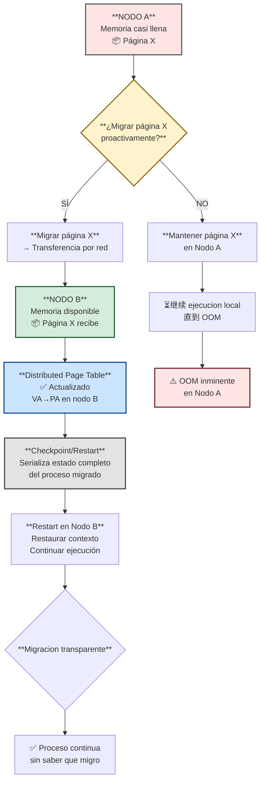

# slide-10-explicacion.md — MOSIX: Administración de Memoria

## Resumen Conceptual

Esta slide presenta los mecanismos de administración de memoria en **MOSIX**, un sistema de cluster que implementa un modelo de memoria **"shared-nothing"** (nada compartido). A diferencia de los sistemas tradicionales donde un solo sistema operativo gestiona toda la memoria, MOSIX coordina múltiples nodos independientes donde cada uno mantiene su propia memoria física local. El concepto central es **Memory Ushering**: la capacidad de migrar procesos completos (con su espacio de memoria) entre nodos cuando uno de ellos detecta presión de memoria, evitando así el swapping local tradicional.

---

## 1. Modelo Shared-Nothing: Fundamento Arquitectónico

### 1.1 ¿Qué significa "shared-nothing"?

El modelo **shared-nothing** en MOSIX implica que **cada nodo posee su propia memoria física local y la administra de forma completamente independiente**. No existe ningún espacio de memoria compartido entre los nodos del cluster. Cada nodo ejecuta su propia instancia de Linux con su propio gestor de memoria, sus propias tablas de páginas, y su propio espacio de direcciones virtual aislado.

Este diseño tiene implicaciones profundas:

- **Sin coherencia de caché**: Al no haber memoria compartida, no existe el problema de mantener coherencia entre cachés de diferentes CPUs/nodos
- **Comunicación por mensajes**: Los nodos se comunican mediante mensajes explícitos a través de la red (Ethernet, Myrinet, etc.)
- **Aislamiento total**: Un fallo en la memoria de un nodo no afecta directamente a los demás nodos

### 1.2 Relación con el temario FSO

Este modelo contrasta fundamentalmente con **NUMA (Non-Uniform Memory Access)** mencionado en §4.1 del temario. En NUMA existe un **único espacio de direcciones compartido** donde todos los nodos pueden ver la misma memoria, pero conlatencias de acceso variables según la ubicación física del dato. En MOSIX hay **múltiples espacios de direcciones completamente independientes**.

| Característica | MOSIX (shared-nothing) | NUMA (shared-everything) |
|----------------|-------------------------|---------------------------|
| Espacio de direcciones | Múltiples aislacos | Único compartido |
| Acceso a memoria remota | Vía migración de procesos | Acceso directo (más lento) |
| Coherencia de caché | No necesaria | Necesaria (CC-NUMA) |
| Latencia acceso remoto | Alta (red) | Media-baja (interconnect) |

### 1.3 Cada nodo gestiona su propia memoria

Cada nodo MOSIX:
- Gestiona su memoria física mediante el gestor nativo de Linux local
- Mantiene sus propias tablas de páginas para mapear direcciones virtuales a físicas
- Tiene control total sobre qué procesos se ejecutan y cuánta memoria consumen
- **No comparte estructuras de memoria** con otros nodos

Esto significa que a nivel de cluster, MOSIX no implementa memoria virtual tradicional (paging a disco). La "ilusión de más memoria" se logra vía migración de procesos completos, no mediante paging.

---

## 2. Memory Ushering: Migración Proactiva de Memoria

### 2.1 Definición y propósito

**Memory Ushering** es el algoritmo central de MOSIX para administración de memoria distribuida. Su propósito es permitir que un nodo que ha **agotado su memoria principal** pueda utilizar la memoria libre disponible en otros nodos del cluster, **migrando procesos en lugar de usar paging o swapping al disco local**.

El término "ushering" (acompañar/guiar) hace referencia a que el sistema guía/procactiva y migra los procesos hacia nodos con memoria disponible **antes de que ocurra una situación de "out of memory" (OOM)**.

### 2.2 Funcionamiento paso a paso

El algoritmo opera en cinco fases:

1. **Detección de memoria baja**: El sistema monitorea continuamente la cantidad de memoria libre en cada nodo mediante umbrales críticos
2. **Identificación proactiva**: Cuando un nodo detecta que su memoria libre está por debajo del umbral, busca nodos con memoria disponible en el cluster
3. **Selección de proceso a migrar**: Se selecciona un proceso del nodo con memoria escasa para ser migrado (no se seleccionan páginas individuales, sino procesos completos)
4. **Transferencia del proceso**: El proceso, incluyendo todo su contexto de memoria (heap, stack, código, datos), se transfiere al nodo destino por la red
5. **Continuación de ejecución**: El proceso continúa ejecutándose en el nodo destino de forma transparente, sin que la aplicación sea consciente de la migración

### 2.3 Características clave del enfoque

**Migración proactiva vs. reactiva**: A diferencia del paging tradicional que reacciona cuando ya hay contención de memoria (fallo de página → búsqueda de frame libre → evictar página), Memory Ushering previene la situación **antes de que ocurra**. El sistema detecta el problema potenciales y migra proactivamente.

**Transparencia para la aplicación**: El proceso migrado no necesita ser modificado ni recompilado. El cambio de nodo es transparente para el código de usuario.

**Integración con balanceo de carga**: Memory Ushering funciona junto con el algoritmo de balanceo de carga de CPU de MOSIX. Ambos mecanismos pueden actuar simultáneamente para optimizar el uso de recursos del cluster.

**Caso de uso principal**: Es particularmente útil cuando la memoria no se usa de manera uniforme entre nodos, cuando hay nodos con diferentes cantidades de RAM, o cuando se crea un proceso tan grande que no cabe en la memoria libre de un solo nodo pero podría ejecutarse si se combinan memorias de múltiples nodos.

### 2.4 Diagrama del flujo — Memory Ushering con Decision y Checkpoint/Restart

**Nota sobre Checkpoint/Restart**: Cuando una página migra proactivamente, el sistema también serializa el estado del proceso para permitir recuperación ante fallos. Si la migración falla o el nodo destino no responde, el proceso puede ser restaurado desde el checkpoint en su nodo original.

---

## 3. Memoria Virtual Distribuida

### 3.1 Tabla de páginas distribuida

En MOSIX, la **memoria virtual del cluster** se conceptualiza de manera distribuida. Cada nodo mantiene su propia tabla de páginas local que mapea direcciones virtuales a físicas dentro de ese nodo. No existe una tabla de páginas global que cubra todo el cluster.

Cuando un proceso migra de un nodo a otro:
- La tabla de páginas del proceso se actualiza para reflejar el nuevo nodo
- Las direcciones virtuales permanecen constantes (el proceso no ve cambio en sus direcciones)
- La traducción de virtuales→físicas ahora ocurre en el nodo destino

### 3.2 Relación con §5.1 del temario (Memoria Virtual)

El concepto de memoria virtual en MOSIX difiere del tradicional:

| Aspecto | SO tradicional (§5.1) | MOSIX |
|---------|----------------------|-------|
| Ilusión de más memoria | Paging a disco | Migración de procesos |
| Tabla de páginas | Una por proceso | Una por proceso, por nodo |
| Fallo de página | Página no en RAM → cargar de disco | Proceso no en nodo → migrar |
| Frame libre | Buscado en memoria local | Buscado en cualquier nodo del cluster |

MOSIX no implementa paging a disco para expandir la memoria lógica. En cambio, cuando un proceso necesita más memoria de la disponible localmente, el sistema puede migrar ese proceso a otro nodo con memoria libre. Esto es conceptualmente similar a un **"swap distribuido" pero a nivel de procesos**, no de páginas.

### 3.3 Checkpoint/Restart: Serialización del Estado de Memoria

**Checkpoint/Restart** es el mecanismo mediante el cual MOSIX permite guardar el estado completo de un proceso (incluyendo su memoria) para poder restaurarlo posteriormente, ya sea en el mismo nodo o en uno diferente. Este mecanismo es fundamental para la migración de procesos y para la tolerancia a fallos.

El proceso de checkpoint implica:

1. **Suspender el proceso**: Detener la ejecución de manera controlada
2. **Serializar el estado de memoria**: Copiar todo el espacio de direcciones del proceso (heap, stack, datos, código) a un formato que pueda ser almacenado o transmitido
3. **Guardar el contexto de ejecución**: Incluir registros del CPU, contador de programa, estado de threads
4. **Almacenar descriptores de archivos**: Los archivos abiertos se manejan mediante DFSA (Direct File System Access)
5. **Generar imagen de checkpoint**: Archivo/binario que contiene todo lo necesario para reiniciar el proceso

La restauración (restart) invierte el proceso:

1. **Leer imagen de checkpoint** del almacenamiento o recibirla por red
2. **Reconstruir el espacio de direcciones**: Recrear la memoria del proceso en el nodo destino
3. **Restaurar contexto de ejecución**: Cargar registros, contador de programa
4. **Reanudar ejecución**: Continuar como si nunca se hubiera detenido

### 3.4 Relación con §2.3 del temario (PCB)

El concepto de checkpoint/restart está directamente relacionado con el **PCB (Process Control Block)** de §2.3. Un checkpoint esencialmente captura todo el estado que está representado en un PCB más el contenido completo de la memoria del proceso:

| Componente PCB (§2.3) | checkpoint/restart |
|----------------------|-------------------|
| PID | ✅ Incluido |
| Estado (Running, Ready, Blocked) | ✅ Incluido |
| PC (contador de programa) | ✅ Incluido |
| Registros de CPU | ✅ Incluidos |
| Información de scheduling (prioridad, quantum) | ✅ Incluida |
| Información de memoria (límites, tablas de páginas) | ✅ Incluida |
| Descriptores de archivos abiertos | ✅ Manejados por DFSA |
| Accounting (tiempos CPU) | ✅ Incluido |

Además de lo que hay en un PCB, el checkpoint incluye la **imagen de memoria completa** del proceso, que no está en el PCB sino que es referenciada por él.

---

## 4. Limitaciones del Modelo de Memoria MOSIX

### 4.1 Sin memoria compartida entre procesos

MOSIX **no soporta memoria compartida entre procesos (shared-memory)** de forma nativa. Esto implica:

- **Sin POSIX shared memory** (`shm_open`, `shm_unlink`)
- **Sin memoria compartida System V** (`shmget`, `shmat`, `shmdt`)
- **Sin DSM (Distributed Shared Memory)** integrada

Las aplicaciones que requieren comunicación mediante memoria compartida (many HPC applications) deben ser reimplementadas usando modelos de paso de mensajes como **MPI (Message Passing Interface)** o sockets.

### 4.2 Modelo shared-nothing por nodo

Cada nodo funciona como un sistema independiente con memoria aislada. Los procesos que necesitan comunicarse entre nodos deben usar mecanismos de red explícitos. No hay forma de que un proceso en nodo A acceda directamente a la memoria de nodo B.

### 4.3 Overhead de red en migración de procesos con mucha memoria

La migración de procesos grandes genera:

- **Overhead de red significativo**: Todo el espacio de direcciones debe transmitirse por la red
- **Tiempo de inactividad**: Durante el handover del proceso, hay un período donde no puede ejecutarse
- **Dependencia del ancho de banda**: La efectividad de la migración depende de la velocidad de la red del cluster
- **Procesos con mucha memoria**: Mig rar procesos que consumen gigabytes de RAM puede tomar minutos en una red convencional

### 4.4 Relación con conceptos de FSO

Estas limitaciones se conectan con varios temas del temario:

**Fragmentación externa (§4.6)**: Al no haber memoria compartida entre nodos, no existe fragmentación externa de memoria compartida. Cada nodo maneja su propia fragmentación local.

**Compactación (§4.7)**: MOSIX no necesita compactación porque no hay memoria compartida que se fragmente. La migración de procesos simplemente relocaliza procesos completos, evitando el problema de compactación en tiempo real.

**Thrashing (§5.6)**: Memory Ushering es precisamente la respuesta al thrashing — detecta proactivamente nodos con memoria baja y migra procesos **antes** de que ocurra contención severa. A diferencia de modelos tradicionales que miden páginas activas (working set), MOSIX mide "disponibilidad de memoria del nodo completo".

---

## 5. Diferenciación con Zephyr

### 5.1 Modelo de memoria de Zephyr

Zephyr implementa un sistema operativo de tiempo real para microcontroladores donde la **gestión de memoria es estática y basada en MPU (Memory Protection Unit)**. Características:

- **MPU con regiones fija**: El MPU divide la memoria en un número limitado de regiones con permisos predefinidos (ej. ARM Cortex-M tiene 8 regiones)
- **Sin memoria virtual**: No hay paginación ni tabla de páginas; la traducción de direcciones es mínima o inexistente
- **Particiones de memoria predefinidas**: La memoria se divide en tiempo de compilación/linking, no dinámicamente
- **Sin swap**: No hay mecanismos de paging o swapping; toda la memoria debe caber en RAM físicamente disponible
- **Memoria compartida limitada**: Solo posible mediante regiones MPU explícitamente configuradas

### 5.2 Modelo de memoria de MOSIX

MOSIX toma un enfoque completamente diferente:

- **Memoria virtual distribuida**: Cada nodo tiene su propia memoria virtual, y el cluster total simula más memoria disponible mediante migración
- **Particiones dinámicas**: Los procesos pueden usar memoria de cualquier nodo del cluster
- **Checkpoint/restart**: Serialización completa de estado para migración y tolerancia a fallos
- **Modelo shared-nothing**: Memoria físicamente aislada por nodo, comunicada vía red

### 5.3 Comparación directa

| Aspecto | Zephyr | MOSIX |
|---------|--------|-------|
| Tipo de sistema | RTOS para microcontroladores | SO para clusters de PCs/servidores |
| Gestión de memoria | MPU estática, regiones fijas | Memoria virtual con migración proactiva |
| Memoria compartida | Limitada, mediante regiones MPU | No existe (shared-nothing) |
| Paginación | No existe | No existe (migración a nivel de proceso) |
| Dynamicidad | Estática en tiempo de compilación | Dinámica en tiempo de ejecución |
|swap | No hay | No hay (migración de procesos) |
| Escala | Un solo核/CPU | Cluster con múltiples nodos |

---

## 6. Conexiones con el Temario FSO

### 6.1 §4.1 y §5.1 — Múltiples procesos compiten por memoria limitada

MOSIX resuelve la competencia por memoria a nivel de cluster. Cuando un nodo agota su RAM, migra procesos completos a otros nodos con memoria disponible, en lugar de usar swapping local. Esto es una **extensión del concepto de "múltiples procesos compiten por memoria limitada" pero a escala de cluster**.

### 6.2 §5.2 — Fallo de página

En MOSIX no hay fallo de página tradicional (una página no está en RAM → cargar del disco). En cambio, existe un concepto diferente: un proceso necesita memoria pero el nodo actual no la tiene disponible → el proceso completo migra a otro nodo. La granularidad de la migración es el proceso entero, no la página individual.

### 6.3 §5.3 — Algoritmos de reemplazo de páginas

Memory Ushering es conceptualmente un algoritmo de reemplazo pero a nivel de **procesos**, no de páginas. En lugar de elegir qué página evictar cuando la memoria está llena (como harían FIFO, LRU, etc.), MOSIX elige **qué proceso migrar** a otro nodo cuando la memoria de un nodo está bajo presión. Es un "process eviction" en vez de "page eviction".

| Etapa | Algoritmo tradicional (§5.3) | Memory Ushering (MOSIX) |
|-------|------------------------------|-------------------------|
| Detección de presión | Page fault ocurre | Umbral de memoria local |
| Selección de víctima | Página menos usada | Proceso con mucha memoria |
| Reubicación | Página a disco | Proceso a otro nodo |
| Reemplazo real | Escritura a swap | Transferencia por red |

### 6.4 §4.3 — MVT (Multiprogramming with Variable number of Tasks)

Cada nodo MOSIX funciona como un sistema independiente con memoria local que puede ser administrada como MVT (particiones variables). A nivel de cluster, MOSIX es más parecido a "particiones variables" porque la memoria disponible varía dinámicamente según qué nodos tengan libres. No hay una tabla global de marcos; cada nodo tiene sus propios frames.

### 6.5 §4.6 — Fragmentación

La fragmentación externa ocurre cuando hay espacios libres no contiguos entre bloques asignados. En MOSIX esto aplica a nivel de cada nodo individual, no a nivel de cluster (porque no hay memoria compartida entre nodos). Un nodo puede tener fragmentación interna si usa particiones fijas, o externa si usa MVT.

### 6.6 §4.7 — Compactación

MOSIX no necesita compactación de memoria a nivel de cluster. La migración de procesos no compacta memoria — simplemente relocaliza procesos completos a otros nodos. No hay necesidad de mover páginas para combinar huecos porque no existe un espacio de memoria compartido que pueda fragmentarse.

---

## 7. Glosario de Términos

### Memory Ushering
Algoritmo de migración proactiva de memoria en MOSIX que permite a un nodo con memoria agotada utilizar memoria libre de otros nodos del cluster, transfiriendo procesos completos en lugar de hacer paging a disco. El nombre proviene de "usher" (acompañar/guiar) porque el sistema guía proactivamente los procesos hacia nodos con recursos disponibles.

### Checkpoint/Restart
Mecanismo de serialización del estado completo de un proceso (memoria, registros, archivos abiertos, contexto de ejecución) que permite guardarlo y restaurarlo posteriormente. Es fundamental para la migración de procesos y para tolerancia a fallos en el cluster.

### Distributed Page Table (Tabla de páginas distribuida)
Modelo donde cada nodo mantiene su propia tabla de páginas para traducir direcciones virtuales a físicas locales. No existe una tabla de páginas global; cuando un proceso migra, su tabla de páginas se transfiere junto con él.

### Page Replacement (Reemplazo de páginas)
En sistemas tradicionales, algoritmo que decide qué página evictar de memoria cuando se necesita un frame libre (FIFO, LRU, etc.). En MOSIX, el equivalente es Memory Ushering que decide qué proceso migrar cuando un nodo tiene presión de memoria.

### Shared-Nothing
Modelo arquitectónico donde cada nodo tiene memoria físicamente independiente y no comparte estructuras de memoria con otros nodos. La comunicación se realiza mediante mensajes explícitos por la red.

### DFSA (Direct File System Access)
Mecanismo de MOSIX para manejar archivos abiertos durante la migración de procesos. Permite que un proceso migrado siga accediendo a archivos del nodo original sin necesidad de copiar todo el estado del sistema de archivos.

### OOM (Out of Memory)
Condición donde un nodo no tiene suficiente memoria libre para asignar a nuevos procesos. En sistemas tradicionales causa swapping o terminación de procesos; en MOSIX dispara la búsqueda de nodos con memoria disponible.

### Working Set
Conjunto de páginas que un proceso está usando activamente. En sistemas tradicionales, el sistema intenta mantener el working set en memoria para evitar thrashing. En MOSIX, el concepto equivalente es la "huella de memoria" del proceso que se transfiere durante la migración.

---

## 8. Resumen Técnico

La administración de memoria en MOSIX se construye sobre un modelo **shared-nothing** donde cada nodo es un sistema independiente con su propia memoria física. El **Memory Ushering** es el mecanismo central: en lugar de paging a disco cuando la memoria local se agota, el sistema detecta proactivamente la presión de memoria y migra procesos completos a nodos con memoria disponible.

La **memoria virtual distribuida** de MOSIX no opera mediante paginación tradicional, sino mediante migración de procesos. El **Checkpoint/Restart** permite serializar el estado completo de un proceso para migrarlo o recuperarlo ante fallos.

Las limitaciones principales son la ausencia de memoria compartida nativa (requiere reimplementación con MPI/sockets), el overhead de red en migraciones de procesos grandes, y la dependencia del ancho de banda del cluster.

Este modelo contrasta fundamentalmente con Zephyr, donde la memoria se administra mediante un MPU estático con regiones fijas configuradas en tiempo de compilación, sin paginación ni migración.

---

## Fuentes

- [Memory ushering in a scalable computing cluster - ScienceDirect](https://www.sciencedirect.com/science/article/abs/pii/S0141933198000775) (Barak & Braver, 1998)
- [The MOSIX Algorithms for Managing Cluster, Multi-Clusters, GPU - TU Dresden](https://os.inf.tu-dresden.de/Studium/DOS/SS2011/05-MOSIX.pdf)
- [The NOW MOSIX and its Preemptive Process Migration Scheme](http://yuval.yarom.org/pdfs/mosix.pdf)
- [Scalable Cluster Computing with MOSIX for LINUX - VT University](https://courses.cs.vt.edu/~cs5204/fall05-kafura/Papers/Migration/mosix.pdf)
- [High Performance Computing with Mosix - ICTP](https://indico.ictp.it/event/a01127/session/33/contribution/22/material/0/1.pdf)
- [Wikipedia: MOSIX](https://en.wikipedia.org/wiki/MOSIX)
- [Wikipedia: Shared-nothing architecture](https://en.wikipedia.org/wiki/Shared-nothing_architecture)
- [MOSIX FAQ](http://www.mosix.cs.huji.ac.il/faq/output/faq_toc.html)