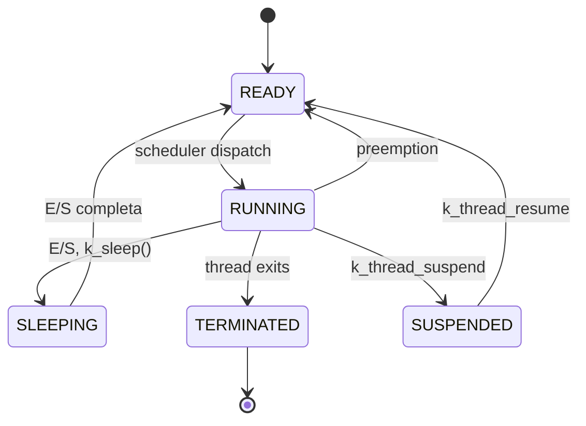

# slide-11-explicacion.md — Zephyr OS: Administración del Procesador

## Overview

Esta slide explica cómo Zephyr OS administra el procesador, enfocándose en thread scheduling, estados de threads, y la arquitectura de control de ejecución. La presentación conecta los conceptos de Zephyr con la teoría de sistemas operativos (§2.1–§2.8 del temario).

---

## 1. Estados de Thread (§2.2 — Estados de un Proceso)

Zephyr implementa un modelo de estados de thread equivalente al modelo clásico de estados de proceso de la teoría de SO:

### 1.1 Los Cinco Estados

| Estado | Descripción | Equivalente FSO |
|--------|-------------|-----------------|
| **READY** | Thread listo para ejecutarse, esperando en la run queue | LISTO (§2.2) |
| **RUNNING** | Thread ejecutándose actualmente en la CPU | EJECUTANDO (§2.2) |
| **SLEEPING** | Thread bloqueado esperando un evento (E/S, timer, recurso) | BLOQUEADO (§2.2) |
| **TERMINATED** | Thread que terminó su ejecución | Término de proceso |
| **SUSPENDED** | Thread pausado temporalmente (no puede ejecutarse) | Estado especial de pause |

### 1.2 Diagrama de Transiciones



### 1.3 Transiciones detalladas

**READY → RUNNING (scheduler)**
- El scheduler elige este thread de la run queue y le otorga la CPU
- Equivale al dispatch del §2.8
- En Zephyr, el scheduler es priority-based: el thread de mayor prioridad listo es el próximo en ejecutar

**RUNNING → SLEEPING (E/S)**
- El thread inicia una operación de entrada/salida o llama a `k_sleep()`, `k_yield()`
- El thread libera la CPU voluntariamente (cooperative) o es bloqueado por una syscall bloqueante
- En el diagrama de la slide: "▼ E/S" indica que el thread se bloquea por operación de E/S

**SLEEPING → READY (E/S completa)**
- El evento por el cual el thread esperaba se completó (interrupción de E/S, timeout, recurso disponible)
- El thread vuelve a la run queue en estado READY
- En la slide: "◀── E/S completa" (flecha punteada)

**RUNNING → READY (preempt)**
- Un hilo de mayor prioridad se vuelve READY y el scheduler lo desaloja
- En la slide: "◀ preempt" (flecha punteada superior)
- Esto es lo que diferencia el scheduling preemptivo del cooperativo

**RUNNING → TERMINATED**
- El thread completa su función de entrada y retorna
- Equivale a que un proceso termina su ejecución

---

## 2. k_thread como PCB Simplificado (§2.3)

### 2.1 PCB en SO clásico

Según §2.3 del temario, el PCB contiene:

| Campo PCB | Descripción |
|-----------|-------------|
| PID | Identificador único |
| Estado | Running, Ready, Blocked, Zombie |
| PC | Contador de programa |
| Registros | Estado de CPU |
| Planificación | Prioridad, quantum, tiempo CPU |
| Memoria | Límites, tablas de páginas |
| Archivos | Descriptores abiertos |
| Accounting | Tiempos de CPU |

### 2.2 k_thread en Zephyr

En Zephyr, cada thread tiene una estructura `k_thread` que cumple la misma función de control block, pero simplificada porque Zephyr no tiene paginación ni memoria virtual completa:

| Campo k_thread | Equivalente PCB | Notas |
|----------------|-----------------|-------|
| Stack pointer | Registros |SP/PC salvados en context switch |
| Priority | Planificación | Entero (negativo = cooperative, ≥0 = preemptive) |
| Options/flags | Planificación | Controlan comportamiento (cooperativo vs preemptivo) |
| State | Estado | READY, RUNNING, SLEEPING, TERMINATED, SUSPENDED |
| Stack area | Memoria | Cada thread tiene su propio stack predefinido |

**Diferencia clave:** En un SO con MMU (como Linux), el PCB incluye tablas de páginas y límites de memoria. Zephyr, al tener single address space y frecuentemente usar MPU (no MMU completa), no necesita esas estructuras. El `k_thread` es un "PCB simplificado" — contiene lo esencial para el scheduling y contexto de CPU, pero sin la complejidad de memoria virtual.

---

## 3. Políticas de Scheduling

Zephyr soporta tres políticas de scheduling que pueden coexistir en la misma aplicación:

### 3.1 Cooperative Scheduling (hilos cooperativos)

| Aspecto | Detalle |
|---------|---------|
| **Prioridad** | Valores **negativos**: -1, -2, -3... |
| **Comportamiento** | Una vez en RUNNING, retiene la CPU hasta que él mismo la libere explícitamente |
| **Liberación de CPU** | `k_yield()`, `k_sleep()`, esperando un recurso (mutex, semaphore, queue) |
| **Sin desalojo involuntario** | No hay timer que le quite la CPU |
| **Uso típico** | Tareas que no pueden ser interrumpidas, operaciones atómicas, código de driver |

```c
// Definición de thread cooperativo
K_THREAD_DEFINE(my_coop_thread_id, STACK_SIZE,
                coop_entry, NULL, NULL, NULL,
                -1, 0, 0);  // prioridad = -1 (cooperative)
```

### 3.2 Preemptive Scheduling (hilos preemptivos)

| Aspecto | Detalle |
|---------|---------|
| **Prioridad** | Valores **no negativos**: 0, 1, 2, 3... |
| **Comportamiento** | Si llega un hilo de mayor prioridad a READY, el scheduler lo pone en RUNNING inmediatamente, desalojando al actual |
| **Latencia** | Garantizada latencia de respuesta para hilos de alta prioridad |
| **Uso típico** | Tasks de tiempo real que deben responder a eventos con deadline |

```c
// Definición de thread preemptivo
K_THREAD_DEFINE(my_preempt_thread_id, STACK_SIZE,
                preempt_entry, NULL, NULL, NULL,
                0, 0, 0);  // prioridad = 0 (preemptive)
```

### 3.3 Hybrid Scheduling (híbrido)

Zephyr permite combinar hilos cooperativos y preemptivos en la misma aplicación:

- Hilos preemptivos (prioridad ≥ 0) pueden ser desalojados por hilos de mayor prioridad
- Hilos cooperativos (prioridad < 0) solo ceden la CPU voluntariamente
- Un hilo preemptivo de baja prioridad puede coexistir con un hilo cooperativo de alta prioridad

**Ejemplo práctico:** Un sistema con:
- Hilo de alta prioridad cooperativa (-1): control de motor que no puede ser interrumpido
- Hilo de media prioridad preemptiva (5): sensor que debe responder a eventos
- Hilo de baja prioridad preemptiva (10): logging que puede esperar

---

## 4. Scheduling Priority-Based sin Round Robin (§2.5)

### 4.1 ¿Por qué no Round Robin?

La slide indica: "Priority-based: sin Round Robin (primer cola = primero)"

En Zephyr, cuando hay múltiples threads con la misma prioridad en estado READY:

1. **No hay time-slicing**: No existe un timer que interrumpa al thread actual para darle quantum a otro de igual prioridad
2. **FIFO por prioridad**: El scheduler mantiene colas FIFO por nivel de prioridad. El primer thread encolado es el primero en ejecutar
3. **Razón de diseño**: En sistemas embebidos de tiempo real, el comportamiento determinista es más importante que la equidad. Round Robin introduce indeterminismo en el scheduling

### 4.2 Comparación con temario §2.5

| Algoritmo (§2.5) | Zephyr lo implementa? |
|-----------------|----------------------|
| FCFS | No (no hay cola global FIFO para todos los procesos) |
| SJF/SRTF | No (no se estima duración de burst) |
| Round Robin | **NO** — Zephyr no tiene quantum clásico |
| Priority-based | **SÍ** — scheduling por prioridad fija |
| Colas multinivel | No exactamente — las colas son solo por prioridad |

### 4.3 Implicancia de no tener Round Robin

- **Starvation posible**: Un thread de baja prioridad podría nunca ejecutarse si siempre hay hilos de mayor prioridad
- **Sin fair sharing**: Threads de igual prioridad no comparten CPU equitativamente — quien llega primero ejecuta hasta que ceda o sea desalojado
- **Predictible**: El comportamiento del scheduler es completamente determinista basándose en prioridades y orden de llegada

---

## 5. Sin Quantum Clásico (§2.7, §2.8)

### 5.1 ¿Qué significa "sin quantum"?

En sistemas con Round Robin (§2.7 temario), cada proceso recibe un quantum (time slice) de CPU. Cuando el quantum se agota, el scheduler preemptiona el proceso y pone otro en RUNNING. Esto requiere:

- Un timer que interrumpa periódicamente
- Un contador de quantum en el PCB
- Un dispatcher que haga context switch

**Zephyr NO tiene esto para threads de igual prioridad.**

### 5.2 Consecuencias de no tener quantum

| Aspecto | Descripción |
|---------|-------------|
| **No time-slicing** | Entre threads de igual prioridad, no hay rotación automática |
| **Syscalls como function calls** | Las llamadas al sistema son invoke directos a funciones del kernel, sin cambio de modo usuario/kernel |
| **Single address space** | Kernel y aplicaciones comparten el mismo espacio de direcciones — elimina la necesidad de cambiar de modo |

### 5.3 Dispatcher eficiente (§2.8)

Según el temario, el dispatcher hace:
1. Cambio de contexto
2. Cambio a modo usuario
3. Reinicialización de registros
4. Salto al PC del nuevo proceso

En Zephyr, gracias al single address space:
- **Las syscalls son function calls**: No hay `int 0x80` ni `syscall` con cambio de modo — se llama directamente a la función del kernel
- **No hay context switch kernel/user**: El overhead descrito en §2.8 se elimina casi completamente
- **Context switch solo entre threads**: Cuando el scheduler decide cambiar de un thread a otro, sí ocurre context switch (salvar/restaurar registros, stack pointer), pero sin el costo adicional de cambiar de modo

---

## 6. Priority Inheritance (Herencia de Prioridad)

### 6.1 El problema: Inversión de Prioridad

En scheduling por prioridad (§2.5), un problema clásico es la **inversión de prioridad**:

1. Hilo H (alta prioridad) necesita un recurso (mutex)
2. Recurso está bloqueado por hilo L (baja prioridad)
3. Hilo M (media prioridad) está ejecutando
4. Hilo H queda esperando aunque tiene mayor prioridad que M

### 6.2 Solución: Priority Inheritance

Zephyr implementa **priority inheritance** para evitar este problema:

| Paso | Acción |
|------|--------|
| 1 | Hilo H intenta acquire mutex que ya tiene hilo L |
| 2 | El scheduler detecta que L sostiene el mutex y eleva la prioridad de L a la de H |
| 3 | Hilo L ahora tiene alta prioridad y puede executar rápidamente, liberando el mutex |
| 4 | Cuando L libera el mutex, su prioridad vuelve a la original |
| 5 | Hilo H acquire el mutex y continúa |

### 6.3 Ejemplo en código

```c
// Hilo L (baja prioridad) adquiere mutex
k_mutex_lock(&my_mutex, K_FOREVER);
// Hace trabajo...
k_mutex_unlock(&my_mutex);

// Hilo H (alta prioridad) intenta acquire
// Como el mutex ya está bloqueado por L, L hereda la prioridad de H
// L ejecuta hasta liberar el mutex, luego H puede continuar
```

---

## 7. Conexión con el Temario FSO

### §2.1 — Necesidad del Scheduling
- Zephyr usa scheduling para cumplir objetivos de tiempo real: minimizar latencia de respuesta para hilos de alta prioridad
- El scheduler debe decidir qué thread ejecutar en cada momento (short-term scheduler)

### §2.2 — Estados de un Proceso
- Modelo de 5 estados de Zephyr es extensión del modelo clásico de 3 estados (READY/RUNNING/BLOCKED)
- TERMINATED y SUSPENDED son estados adicionales para manejo del ciclo de vida del thread

### §2.3 — PCB
- `k_thread` es el equivalente funcional del PCB en Zephyr
- Simplificado porque Zephyr no tiene paginación ni memoria virtual completa

### §2.5 — Algoritmos de Scheduling
- Zephyr implementa **priority-based scheduling** (no Round Robin)
- Híbrido porque permite coexistence de hilos cooperativos y preemptivos
- Las prioridades negativas vs no negativas controlan el comportamiento

### §2.6 — Efecto Convoy
- En scheduling cooperativo, si un hilo de baja prioridad retiene la CPU innecesariamente, los demás sufren latencia — problema análogo al convoy
- En preemptivo puro, hilos de alta prioridad podrían causar starvation de baja prioridad

### §2.7 — Quantum óptimo
- Zephyr NO tiene quantum clásico — no hay time-slicing automático
- El "quantum" en Zephyr es el tiempo que un hilo ejecuta hasta que cede o es desalojado por uno de mayor prioridad

### §2.8 — Dispatcher
- Las funciones del dispatcher se cumplen, pero con overhead reducido por single address space
- Las syscalls son function calls directos, no hay cambio de modo kernel/user

---

## 8. Glosario de Términos

### Términos de Zephyr

| Término | Definición |
|---------|------------|
| **k_thread** | Estructura de control que representa un thread, equivalente simplificado al PCB de SO clásico |
| **Thread** | Unidad básica de ejecución en Zephyr, con stack propio, prioridad, y estado |
| **Run queue** | Cola de threads listos para ejecutar, mantenida por el scheduler |
| **k_yield()** | Syscall para que el thread actual ceda la CPU voluntariamente |
| **k_sleep()** | Syscall para bloquear el thread por un tiempo determinado |
| **k_mutex** | Mecanismo de sincronización para exclusion mutua entre threads |
| **MPU** | Memory Protection Unit — mecanismo de protección de memoria (alternativa a MMU para sistemas embebidos) |

### Estados de Thread

| Estado | Significado |
|--------|-------------|
| **READY** | Thread en la run queue, esperando CPU |
| **RUNNING** | Thread ejecutándose activamente |
| **SLEEPING** | Thread bloqueado, esperando evento |
| **TERMINATED** | Thread que completó su ejecución |
| **SUSPENDED** | Thread pausado externamente |

### Políticas de Scheduling

| Política | Característica |
|----------|---------------|
| **Cooperativo** | Prioridad negativa, retiene CPU hasta que la libere voluntariamente |
| **Preemptivo** | Prioridad no negativa, puede ser desalojado por hilo de mayor prioridad |
| **Híbrido** | Mezcla de cooperativo y preemptivo en la misma aplicación |
| **Priority-based** | Scheduler elige el thread de mayor prioridad listo |
| **Sin Round Robin** | No hay time-slicing entre threads de igual prioridad |

### Conceptos FSO relacionados

| Concepto | Descripción |
|----------|-------------|
| **PCB** | Process Control Block — estructura de control de un proceso (§2.3) |
| **Quantum** | Time slice en Round Robin (§2.7) |
| **Context switch** | Cambio de un proceso/thread a otro (§2.8) |
| **Dispatcher** | Componente que realiza el context switch (§2.8) |
| **Inversión de prioridad** | Problema donde hilo de baja prioridad bloquea a uno de alta prioridad |
| **Priority inheritance** | Solución a la inversión de prioridad |

---

## 9. Resumen Técnico

La administración del procesador en Zephyr se caracteriza por:

1. **Modelo de 5 estados**: READY → RUNNING → SLEEPING + TERMINATED + SUSPENDED
2. **k_thread ≈ PCB simplificado**: Estructura de control de thread sin paginación/memoria virtual
3. **Scheduling priority-based**: Mayor prioridad siempre primero, sin Round Robin
4. **Políticas híbridas**: Cooperative (prioridad < 0) y preemptive (prioridad ≥ 0) coexistiendo
5. **Sin quantum clásico**: No hay time-slicing; syscalls son function calls directos
6. **Single address space**: Kernel y apps comparten espacio, syscall como invoke directo
7. **Priority inheritance**: Evita inversión de prioridad en mutexes

Estos decisiones de diseño reflejan las prioridades de Zephyr como RTOS para sistemas embebidos: determinismo, overhead mínimo, y eficiencia de recursos.