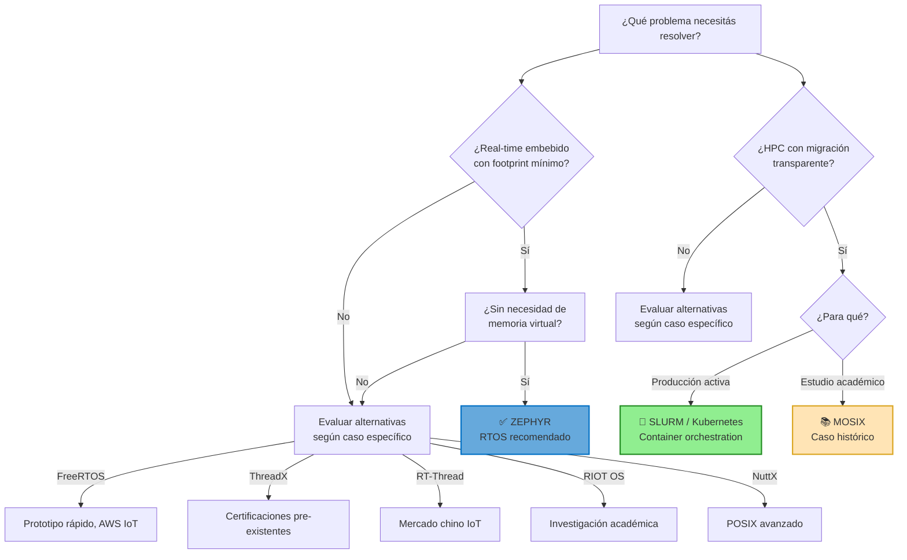

# slide-28-explicacion.md — Conclusiones y Recomendaciones

## Introducción

La slide 28 funciona como sección de cierre del Trabajo Práctico Especial, sintetizando findings de las 24 carpetas de investigación en dos dimensiones: **qué conclude** el análisis comparativo sobre Zephyr OS y MOSIX, y **qué recomienda** para distintos casos de uso en 2026. El mensaje central es que ambos sistemas operan en segmentos de mercado radicalmente diferentes — intentar declararle "ganador" es un error conceptual de categoría, no de spec.

Esta explicación profundiza cada punto de la slide, conecta con el temario FSO donde aplica, y proporciona el contexto técnico necesario para defender estas conclusiones ante un tribunal universitario.

---

## 1. Conclusiones

### 1.1 Mercados Diferentes (Zephyr → IoT Embebido; MOSIX → HPC Académico)

**Qué muestra la slide:**
- Conclusión: "Mercados diferentes — Zephyr → IoT embebido; MOSIX → HPC académico"

**Explicación técnica:**

Zephyr OS y MOSIX no compiten por los mismos recursos ni resuelven los mismos problemas. Esta es la conclusión más importante de toda la comparativa: **no existe "el mejor sistema operativo" — existe "el sistema operativo correcto para este problema específico"** (§1.4 del temario).

**Dominio Zephyr:** Sistemas embebidos IoT. Zephyr corre en microcontroladores individuales con recursos extremadamente restringidos (desde ~4 KB de RAM). El problema que resuelve es ejecutar tareas de tiempo real determinístico en dispositivos de bajo consumo: sensores industriales, wearables, dispositivos médicos, controladores industriales. La escala es **un dispositivo físico**.

**Dominio MOSIX:** HPC (High Performance Computing) en clusters. MOSIX administraba múltiples computadoras Linux como un único sistema lógico (Single System Image). El problema que resolvía era convertir decenas o centenas de PCs en un supercomputador virtual para cómputo paralelo científico. La escala era **cientos de nodos**.

**Analogía del temario:** Esta diferencia es análoga a la diferencia entre un scheduler de corto plazo (§2.1-2.5) que administra CPU en un sistema monousuario y un scheduler de largo plazo que controla admisión de jobs en un mainframe batch. Son problemas complementarios en el espectro de administración de recursos, no competidores directos.

**Por qué importa para FSO:** Ilustra el principio de §1.4 — Arquitecturas de SO — donde se establece que diferentes arquitecturas (monolítica, microkernel, capas) no son "mejores" o "peores" en abstracto, sino que cada una responde a constraints específicos del problema. Zephyr usa un kernel monolítico configurado para footprint mínimo (§4.1-4.3: administración de memoria con particiones fijas optimizadas para dispositivos restringidos). MOSIX usaba un modelo SSI (Single System Image) distribuido (§4.4-4.6: paginación y segmentación distribuida). La arquitectura correcta depende del dominio.

---

### 1.2 Zephyr: Activo y Viable (3000+ Contribuidores, Adopción Comercial Creciente)

**Qué muestra la slide:**
- Conclusión: "Zephyr: activo y viable — 3000+ contribuidores, adopción comercial creciente"

**Explicación técnica:**

Zephyr Project celebra su 10mo aniversario en 2026 con métricas verificables de proyecto activo:

**Gobernanza neutral multisponsor:** Zephyr pertenece a la Linux Foundation y es gobernado por un Technical Steering Committee con miembros Platinum (Nordic Semiconductor, Intel, NXP, Renesas, Wind River). Esta estructura significa que ninguna empresa puede discontinuar el proyecto unilateralmente. Para productos con ciclos de vida de 10-20 años (industria, medicina), esta estabilidad de gobernanza es un factor crítico de decisión.

**Seguridad integrada:** A diferencia de competidores donde seguridad es feature opcional, Zephyr incluye:
- PSA Crypto API con implementación mbedTLS
- Secure boot chains
- Secure storage basado en PSA
- Memory Protection Unit (MPU) con user mode
- Security Subcommittee dedicado

**Conectividad wireless integrada:** BLE, Wi-Fi, Thread, 802.15.4, LoRa, Cellular, CAN bus — todos disponibles directamente en el kernel, sin necesidad de agregar stacks manualmente.

**Portabilidad extrema:** +1000 boards soportadas, +15 arquitecturas de CPU. El sistema Devicetree permite abstraer configuración de hardware sin modificar código de aplicación.

**Adopción comercial:** 70% de organizaciones en Norteamérica y 62% en Europa ya usan Zephyr en productos comerciales, con 69% planeando aumentar adopción (Linux Foundation Research, marzo 2026).

**Conexión con temario FSO:** El modelo de gobernanza de Zephyr refleja un patrón visto en §1.4 — cuando múltiples organizaciones tienen stake en un sistema, la gobernanza neutral (similar al modelo UNIX con AT&T y BSD dividiendo desarrollo) favorece longevidad. La estructura de seguridad con MPU (Memory Protection Unit) conecta directamente con §4.4-4.6: paginación y segmentación — la MPU implementa protección a nivel de segmentos/páginas definidas estáticamente en tiempo de compilación, algo que en el temario se estudiaría como "protección por bounds registers".

---

### 1.3 MOSIX: Histórico (Solo Valor Académico — Abandonware desde 2017)

**Qué muestra la slide:**
- Conclusión: "MOSIX: histórico — Solo valor académico — abandonware desde 2017"

**Explicación técnica:**

MOSIX (Multi-Operating System Intellect System) fue desarrollado por el Grupo de Investigación en Sistemas Distribuidos de la Hebrew University of Jerusalem bajo el liderazgo del Prof. Amnon Barak. Su última versión (MOSIX-4.4.4) fue lanzada el 24 de octubre de 2017 — hace más de 8 años.

**Estado actual:**
- Sin actualizaciones de seguridad
- Sin soporte comercial disponible
- Sin compatibilidad con kernels Linux modernos
- Sin uso documentado en producción después de 2017
- Licencia propietaria restrictiva que prohíbe ingeniería reversa y creación de obras derivadas

**Valor histórico y pedagógico:** MOSIX sigue siendo enseñado en universidades porque ilustra conceptos fundamentales que siguen relevantes:

- **Migración de procesos preemptiva:** MOSIX fue el primer sistema en demostrar migración preemptiva funcional en un cluster Linux (1999). Durante más de 40 años (desde 1977), innovó en convertir múltiples máquinas físicas en un supercomputador virtual.

- **Single System Image (SSI):** Concepto donde un cluster se presenta como un único sistema con vista unificada de CPU, memoria y procesos. Los usuarios no especificaban en qué nodo ejecutaban — el sistema decidía dinámicamente.

- **Memory Ushering:** Algoritmo sofisticado que detectaba proactivamente nodos con poca memoria y migraba procesos antes de OOM. Ejemplo clásico enseñado en cursos de sistemas distribuidos.

**Conexión con temario FSO:** SSI conecta con §4.4-4.6 (paginación y segmentación). La diferencia conceptual entre paginación local y el enfoque distribuido de MOSIX es un ejemplo de cómo los mismos problemas fundamentales (§4.1: múltiples procesos competiendo por recursos limitados) se resuelven de forma radicalmente diferente según la arquitectura. El algoritmo Memory Ushering de MOSIX es análogo al algoritmo de reemplazo de páginas visto en §5.3 — pero operando a nivel de procesos completos en lugar de páginas individuales.

---

### 1.4 Evolución del HPC (MOSIX → SLURM → Kubernetes)

**Qué muestra la slide:**
- Conclusión: "Evolución del HPC — MOSIX → SLURM → Kubernetes (contenedores)"

**Explicación técnica:**

Esta conclusión traza la evolución histórica de tecnologías de cluster management desde 1990 hasta 2026:

**MOSIX (1999-2017):** Migración de procesos a nivel kernel. Convertía múltiples Linux machines en un supercomputador virtual con SSI. Innovador para su era, pero limitado por ser propietario y por la complejidad de mantener migración transparente a nivel kernel.

**SLURM (Simple Linux Utility for Resource Management, 2003-presente):** Abandonó la migración transparente a nivel kernel a favor de job scheduling explícito. Los usuarios especifican recursos explícitamente; SLURM schedulea jobs en nodos específicos. Modelo más simple, más escalable, y compatible con hardware moderno. SLURM mantiene >60% de adopción en Top500 supercomputers.

**Kubernetes (2014-presente):** Llevó el concepto más allá con containerization. En lugar de migrar procesos individuales, Kubernetes administra containers (unidades de aplicación autocontenidas) que pueden moverse entre nodos. La containerización resuelve problemas que MOSIX no podía:
- Portabilidad: containers incluyen dependencias, eliminando "funciona en mi máquina"
- Eficiencia: overhead menor que VMs completas
- Escalabilidad: orchestration automático de múltiples réplicas
- GitOps: integración con CI/CD

**Por qué evolucionó:** La evolución de MOSIX → SLURM → K8s responde a cambios en los problemas y constraints:

| Constraint | MOSIX (1999) | SLURM (2003) | Kubernetes (2014) |
|------------|--------------|--------------|-------------------|
| Escala típica | Decenas de nodos | Miles de nodos | Miles de pods |
| Hardware | Homogéneo | Homogéneo | Heterogéneo (cloud) |
| Modelo de app | monolítica | HPC jobs | microservicios |
| Portabilidad | Baja | Media | Alta |

**Conexión con temario FSO:** La evolución de scheduling domains (§2.5: scheduling algorithms) muestra cómo los objetivos del scheduler — throughput, utilization, response time, fairness — se optimizan de forma diferente según la escala y el workload. SLURM usa backfill scheduling para maximizar utilization en supercomputers; Kubernetes usa bin-packing para optimizar利用率 en cloud. Esta evolución refleja lo que el temario establece en §2.1 sobre scheduling: los objetivos son contextuales, no absolutos.

---

### 1.5 Diseño Depende del Dominio (§1.4)

**Qué muestra la slide:**
- Conclusión: "Diseño depende del dominio — §1.4 — arquitectura correcta para problema"

**Explicación técnica:**

Esta conclusión conecta explícitamente con el temario FSO, específicamente con §1.4 — Arquitecturas de SO:

**§1.4 establece cuatro arquitecturas fundamentales:**

| Arquitectura | Descripción | Limitaciones |
|--------------|-------------|--------------|
| **Monolítica** | Todo en modo kernel | Inflexible para cambios |
| **Por capas** | Capas jerárquicas | Overhead de capas |
| **Microkernel** | Kernel mínimo, servicios en usuario | IPC overhead |
| **Cliente-Servidor** | Servicios como servidores | Latencia de red |

Ninguna es "mejor" en abstracto. Un microkernel como QNX es óptimo para automotive safety systems donde aislamiento de fallos es crítico. Un kernel monolítico como Linux es óptimo para servidores donde throughput máximo es la prioridad. Un RTOS como Zephyr usa kernel monolítico configurado para footprint mínimo — el mismo Linux, pero con Kconfig ajustando exactamente qué features se compilan.

**MOSIX como ejemplo de arquitectura SSI:** MOSIX implementaba Single System Image, una arquitectura que no aparece explícitamente en §1.4 pero que es conceptualmente cercana a "máquinas virtuales" (donde múltiples SO simulados corren sobre hardware físico). En SSI, el cluster se presenta como un único sistema — lo inverso de la virtualización tradicional donde un físico simula múltiples.

**Conexión con administración de memoria:** §4.4-4.6 del temario establece que paginación elimina fragmentación externa pero introduce overhead de TLBs, mientras que segmentación provee división lógica natural pero puede causar fragmentación externa. La elección entre paginación, segmentación, o una combinación — y la decisión de usar memoria virtual — depende del workload. Zephyr para IoT típicamente no usa memoria virtual (demasiado overhead para microcontroladores de 4KB); MOSIX usaba memoria virtual distribuida para soportar SSI.

---

## 2. Recomendaciones

### 2.1 Zephyr para IoT Embebido (RTOS Recomendado, Tiempo Real, Activo)

**Qué muestra la slide:**
- Recomendación: "Zephyr para IoT embebido — RTOS recomendado, tiempo real, activo"

**Explicación técnica:**

Para proyectos de sistemas embebidos IoT en 2026, Zephyr es la recomendación primaria porque:

**Tiempo real determinístico:** Zephyr soporta múltiples modos de scheduling (§2.5 del temario: cooperative, preemptive, hybrid) que pueden configurarse estáticamente en tiempo de compilación. Para sistemas de tiempo real, esta configurabilidad es crítica — el comportamiento debe ser determinístico, no probabilístico. Un sensor médico que debe responder en 1ms exactos no puede depender de scheduling dinámico que varía según carga.

**Footprint mínimo con features completos:** Kernel puede compilarse en ~4KB, pero incluye features que otros RTOS de bajo footprint no tienen: TLS/DTLS, Bluetooth LE stack, file systems (LittleFS, FAT), networking completo. Esto contrasta con FreeRTOS, que requiere agregar cada feature manualmente.

**Active development:** 3000+ contribuidores, releases regulares, Security Subcommittee activo. Un proyecto abandonado como MOSIX representa riesgo operativo: sin security patches, sin soporte para hardware nuevo, sin evolución para integrar características modernas.

**Conexión con temario FSO:** La configuración de scheduling en Zephyr es un ejemplo práctico de §2.4 (tipos de schedulers) y §2.5 (algoritmos). En Zephyr, el developer elige entre:
- **Cooperative:** El proceso corre hasta que cede voluntariamente — similar a FCFS pero con yield explícito
- **Preemptive:** El scheduler puede desalojar procesos según prioridad — similar a priority scheduling con starvation mitigation
- **Hybrid:** Combina ambos

Para IoT embebido, la opción híbrida es común: tasks críticas (sensor sampling, comunicación) son preemptive; tasks de bajo priority pueden ser cooperative para minimizar overhead de context switches.

---

### 2.2 Zephyr para Proyectos Comerciales (Gobernanza Neutral, LTS, Sin Vendor Lock-in)

**Qué muestra la slide:**
- Recomendación: "Zephyr para proyectos comerciales — Gobernanza neutral, LTS, sin vendor lock-in"

**Explicación técnica:**

Para productos comerciales con ciclos de vida de 10-20 años (industria, medicina, automotive), Zephyr ofrece garantías que otros RTOS no ofrecen:

**Gobernanza neutral:** La Linux Foundation no tiene producto hardware que compita con los subscribers de Zephyr. Nordic Semiconductor, Intel, NXP, Renesas — todos fabrican chips pero todos se benefician de un Zephyr healthy. Esto contrasta con FreeRTOS (Amazon AWS tiene un servicio cloud competidor de IoT) o ThreadX (Microsoft tiene Azure IoT competidor).

**LTS (Long Term Support):** Zephyr LTS3 proporciona estabilidad asegurada por años. Para productos médicos certificados o industriales con regulation compliance, cambiar el OS es costoso y requiere recertificación. Un LTS activo significa que el código base es estable y auditado, no un blanco móvil.

**Sin vendor lock-in:** Devicetree + Kconfig + POSIX-compatible APIs significa que código escrito para Zephyr puede portarse a otro RTOS con esfuerzo limitado. Las capas de abstracción de hardware (HAL) están diseñadas para portabilidad cross-vendor. Si mañana otro microcontroller ofrece mejor price/performance, la migración es feasible.

**Seguridad como diferenciador:** El mercado IoT regulado (medical, industrial, automotive) requiere features de seguridad que antes eran opcionales. Zephyr incluye lo que §5.3 del temario llama "page replacement policies" pero a nivel de memoria física: MPU-based protection, secure boot, cryptographic services. Para MOSIX, la seguridad era limitada porque no había Security Subcommittee ni proceso de security advisories.

**Conexión con temario FSO:** La gobernanza de Zephyr refleja principios de §1.3 sobre modularidad y abstracción. Así como UNIX introdujo camadas de abstracción (kernel → system calls → library calls → application), Zephyr introduce camadas de portabilidad (app → HAL → devicetree → board defs). Esto permite que las capas superiores sean portables mientras las capas inferiores son board-specific.

---

### 2.3 MOSIX: Solo Estudio Académico (Para Aprender Migración de Procesos y SSI)

**Qué muestra la slide:**
- Recomendación: "MOSIX: solo estudio académico — Para aprender migración de procesos y SSI"

**Explicación técnica:**

MOSIX no se recomienda para producción porque está abandonado desde 2017. Sin embargo, para estudio académico de conceptos de sistemas distribuidos, sigue siendo valioso:

**Migración de procesos:** La migración preemptiva live de MOSIX — donde un proceso en ejecución puede moverse de un nodo a otro con su contexto completo de CPU, memoria, y archivos abiertos — es un concepto fundamental en sistemas distribuidos. Kubernetes implementa algo similar con pod migration entre nodes;understanding cómo MOSIX lo hacía a nivel kernel ayuda a entender por qué las soluciones modernas prefieren containerization.

**Single System Image:** El concepto de SSI — presentar un cluster como un único sistema — sigue relevante en cloud computing. Cuando un developer hace `kubectl run` sin especificar en qué nodo corre el pod, está interactuando con un SSI rudimentario. Entender SSI ayuda a entender por qué Kubernetes abstrae nodos como un pool de recursos.

**Algoritmos de balanceo de carga:** El Memory Ushering de MOSIX es un ejemplo clásico de algoritmos distribuidos enseñados en cursos de sistemas operativos. Los algoritmos de §2.5 (scheduling) tienen análogos en contexto distribuido: cómo decidir dónde colocar un proceso nuevo (load balancing), cómo responder a overload (migration), cómo manejar recursos heterogéneos (hetero-aware scheduling).

**Evolución como caso de estudio:** El paper de 1998 sobre MOSIX fue citado 488 veces — demuestra impacto intelectual. Pero el proyecto murió. Entender por qué murió — abandonware, licencia propietaria restrictiva, falta de gobernanza neutral — es tan educativo como entender sus innovations técnicos. La historia de MOSIX es un caso de estudio de por qué la licencia y la comunidad determinan longevidad (§1.3: el papel del software de sistema y aplicaciones).

---

### 2.4 NO Usar MOSIX en Producción (Abandonado, Sin Seguridad, Propietario)

**Qué muestra la slide:**
- Recomendación: "NO usar MOSIX en producción — Abandonado, sin seguridad, propietario"

**Explicación técnica:**

Esta recomendación es categórica y no tiene matices. MOSIX no debe usarse en producción por tres razones independientes que se refuerzan mutuamente:

**Abandonado:** Última versión: 24 de octubre de 2017. Sin updates, sin security patches, sin soporte. Cualquier vulnerabilidad descubierta desde entonces permanece sin fix. En un ambiente de producción donde seguridad de datos es regulada (HIPAA, GDPR, IEC 62443), usar software sin security support es un fail de compliance.

**Sin seguridad:** MOSIX fue diseñado antes de que seguridad fuera un requirement table-stakes para sistemas distribuidos. No tiene el equivalente de:
- Secure boot chains
- Cryptographic APIs para at-rest y in-flight encryption
- Authentication/authorization a nivel de proceso
- Vulnerability disclosure process

En 2026, usar software sin these features en producción es irresponsable.

**Propietario:** La licencia restrictiva de MOSIX prohíbe ingeniería reversa y creación de obras derivadas. Esto significa:
- No se puede auditar el código
- No se puede fix bugs sin violar la licencia
- No se puede extender funcionalidad
- Las contribuciones son IP del Prof. Amnon Barak, no de la comunidad

En contraste, SLURM ( GPLv2 ) y Kubernetes ( Apache 2.0 ) permiten auditoría, contribución, y extensión — y tienen security vulnerability disclosure processes activos.

**Conexión con temario FSO:** La recomendación "no usar MOSIX en producción" conecta con §1.2 (generaciones de SO) y §1.3 (conceptos fundamentales) donde se establece que un SO debe actuar como gestor de recursos eficiente y máquina extendida. Un sistema que no puede garantizar seguridad de datos ( §4.1-4.7: administración de memoria y protección ) no cumple estos objetivos. La protección y seguridad (§6 del temario, no alcanzado en TPs) son requisitos para sistemas de producción.

---

## 3. Matriz de Decisión

### 3.1 Cuándo Elegir Zephyr vs Alternatives

La matriz de decisión conecta recomendaciones específicas con casos de uso concretos, permitiendo que un engineer evalúe cuál opción es apropiada según constraints de proyecto:

**Zephyr OS — cuándo es la elección correcta:**

| Caso de uso | Factor determinante |
|-------------|---------------------|
| Producto IoT comercial con ciclo de vida 10+ años | LTS3 activo + gobernanza neutral |
| Dispositivo médico o industrial regulado | Security Subcommittee + PSA Crypto + certifications path |
| Requiere múltiples protocolos wireless | BLE + Wi-Fi + Thread + LoRa integrados |
| Portabilidad cross-vendor (cambiar de NXP a Nordic) | +1000 boards, Devicetree abstraction |
| Proyecto con budget limitado para licensing | Apache 2.0 (no copyleft, sin costos de licensing) |

**Alternativas a Zephyr y cuándo considerarlas:**

| Alternativa | Cuándo elegirla |
|-------------|----------------|
| FreeRTOS | Prototipo rápido sin experiencia embebida, ecosistema AWS IoT |
| ThreadX | Certificaciones pre-existentes (IEC 61508, ISO 26262) necesarias |
| RT-Thread | Producto para mercado chino IoT |
| RIOT OS | Investigación académica con barrier baja de entrada |
| NuttX | Requiere POSIX compatibility avanzada |

**Conexión con temario FSO:** La matriz refleja los objetivos del scheduler (§2.1): para IoT industrial con longos ciclos de vida, se prioriza **predictability y response time** (Zephyr con preemptive scheduling configurable). Para prototype rápido donde time-to-market > determinismo, se prioriza **throughput** (FreeRTOS con simple cooperative scheduling). El tradeoff entre these objetivos es lo que §2.1-2.5 establece como la razón de existencia de múltiples algoritmos de scheduling.

---

### 3.2 Evolución Clusters → Contenedores (MOSIX → Kubernetes)

**Contexto histórico:**

La progresión MOSIX → SLURM → Kubernetes no es solo "nuevos tools replacing old ones" — representa cambios fundamentales en cómo se piensa la computación distribuida:

**Era 1: Migración a nivel kernel (MOSIX, 1977-2017)**
- Problema: Convertir multiple físicos en un supercomputador virtual
- Solución: SSI con migración de procesos transparéntica
- Limitación: Complejidad de mantener transparencia a nivel kernel; overhead de context transfer; licensia propietaria

**Era 2: Job scheduling explícito (SLURM, 2003-presente)**
- Problema: Scheduling eficiente de jobs HPC en supercomputers
- Solución: Jobs explícitamente scheduler a nodos; sin migración transparéntica
- Ventaja: Simplicidad conceptual; escalabilidad a miles de nodos; open source

**Era 3: Container orchestration (Kubernetes, 2014-presente)**
- Problema: Deploy y management de microservicios en cloud híbrido
- Solución: Containers como unidad de packaging; pods como unidad de scheduling; services como abstracción de red
- Ventaja: Portabilidad (dev = prod); efficiency (overhead menor que VMs); GitOps integration; declarative configuration

**Por qué contenedores ganan sobre migración de procesos:**

| Factor | Migración de procesos (MOSIX) | Containerización (K8s) |
|--------|-------------------------------|-------------------------|
| Estado transferido | Contexto de CPU + memoria + fd | Imagen de container + volumes |
| Tamaño de transfer | Potencialmente GB | MB (imagen layers son shared) |
| Portabilidad | Limitada a Linux homogéneo | Cualquier runtime compliant |
| Overhead de move | Alto (suspend → transfer → resume) | Bajo (pull image if needed) |
| Estado parcial | Si migración falla, proceso puede quedar en estado inconsistente | Stateless design; si falla, se levanta replica nueva |

**Conexión con temario FSO:** La evolución clusters → containers refleja la evolución de métodos de asignación de archivos (§3.6: contiguo → enlazado → FAT → i-nodos) y administración de memoria (§4.4: particiones → paginación → segmentación → paging). En cada caso, la tecnología más nueva no es "mejor" en abstracto sino que resuelve problemas que la anterior no podía a escala. Containers resuelven el problema de "cómo hacer deploy de aplicaciones complejas en infrastructure heterogénea" que migración de procesos no podía resolver eficientemente.

---

## 4. Glosario de Términos

### Decision Matrix (Matriz de Decisión)

**Definición:** Herramienta de análisis que mapea criterios de decisión contra opciones disponibles, ponderando factores para determinar la mejor elección según contexto específico.

**En este TP:** La matriz de decisión para Zephyr vs alternatives pesa factores como ciclo de vida, requerimentos de seguridad, conectividad wireless, gobernanza, y portabilidad cross-vendor. Cada factor tiene peso según el caso de uso: un producto médico prioriza seguridad y ciclo de vida sobre time-to-market; un prototipo prioriza velocidad de desarrollo.

**Ejemplo de aplicación en temario FSO:** La decisión entre FCFS y Round Robin (§2.5) es una decision matrix implícita donde se pesan throughput vs response time vs fairness. FCFS maximize throughput pero puede causar convoy effect; Round Robin mejora response time pero introduce overhead de context switches. La "mejor" elección depende de si el workload es CPU-bound interactivo (Round Robin) o batch (FCFS).

---

### Production Readiness

**Definición:** Atributo de un sistema que indica que está listo para uso en producción comercial o industrial, lo que implica: security patches activos, soporte comercial disponible, compatibility con hardware moderno, documentação completa, y estabilidad verificada.

**En este TP:** Zephyr en 2026 es production-ready porque tiene: Security Subcommittee activo, LTS releases, soporte corporativo de miembros platinum, +1000 boards soportadas con soporte vendor, y adoption comercial verificable. MOSIX no es production-ready porque: sin updates desde 2017, sin security patches, sin soporte comercial, sin comunidad activa, y licencia propietaria restrictiva.

**Complemento en temario FSO:** Production readiness conecta con los conceptos de **confiabilidad y disponibilidad** que se estudian en sistemas distribuidos y que tienen equivalentes en administración de recursos del SO. Un sistema de archivos donde los metadata updates no son atómicos (§3.4: atributos de archivo) no es production-ready para databases. Un scheduler sin mecanismo de preemption (§2.5: scheduling algorithms) no es production-ready para sistemas interactivos.

---

### Containerization (Contenedorización)

**Definición:** Tecnología de virtualización ligera donde aplicaciones se empaquetan con sus dependencias en unidades aisladas (containers) que comparten el kernel del host pero tienen файловые systems, red, y process spaces aislados.

**En este TP:** Kubernetes usa containerization como evolución de la migración de procesos. En lugar de migrar el proceso con su contexto completo de CPU (memoria, registros, file descriptors), se migra una imagen de container que contiene la aplicación y sus dependencias. Esto reduce overhead de migración porque las imágenes son layeres compartidas y pueden hacer snapshot/download incremental.

**Complemento en temario FSO:** Containerization es una forma de **aislamiento de procesos** análoga a lo que el temario describe en §1.7-1.8: el SO provee aislamiento entre procesos usando内存protection (§4.4: paginación con page tables) yfile descriptor tables (§3.3: atributos de archivo). Containers extienden este aislamiento al nivel de файловый sistema y networking, usando **cgroups** (control groups) y **namespaces** — features del kernel Linux que implementan aislamiento a nivel de SO, no de hardware virtualization.

---

### Architectural Choices (Elecciones Arquitectónicas)

**Definición:** Decisiones de diseño que determinan cómo un sistema está estructurado, qué tradeoffs hace, y qué constraints acepta. En sistemas operativos, incluyen: monolithic vs microkernel, cooperative vs preemptive scheduling, demand paging vs prepaging, y countless otras.

**En este TP:** Las architectural choices de Zephyr vs MOSIX demuestran por qué §1.4 enseña que "no existe la mejor arquitectura — existe la correcta para el problema." Zephyr eligió:
- Kernel monolítico (no microkernel) para minimizar overhead y permitir footprint de 4KB
- Configuración estática en tiempo de compilación (no dinámica) para determinismo en tiempo real
- POSIX-compatible APIs para portabilidad de aplicaciones
- Governance neutral multisponsor para longevidad

MOSIX eligió:
- SSI distributed architecture para transparently usar múltiples máquinas
- Migración de procesos a nivel kernel para transparencia
- Licencia propietaria restrictiva que limitó contribución comunitaria

**Complemento en temario FSO:** Las architectural choices de §1.4 (monolithic, layered, microkernel, client-server) no son solo históricas — tienen consecuencias prácticas. Un microkernel como QNX se elige para automotive safety porque isolate faults; un monolithic kernel como Linux se elige para servidores porque maximize throughput. Estas eleccciones son las que permiten que "el campo de sistemas operativos produzca soluciones especializadas porque los problemas son radicalmente distintos."

---

### Scheduling Domains

**Definición:** Concepto en sistemas de alto performance donde múltiples schedulers operan en diferentes niveles jerárquicos, cada uno administrando un conjunto específico de recursos. SLURM implementa scheduling multinivel con partitions, donde cada partition tiene su propio scheduler.

**En este TP:** La nota académica de la slide menciona "scheduling domains" en el kontekst de la evolución MOSIX → SLURM. SLURM implementa:
- **Job scheduling** (largo plazo): Admite jobs al sistema
- **Node scheduling** (medio plazo): Asigna jobs a nodos específicos
- **Step scheduling** (corto plazo): Dentro de un job, divide recursos entre tasks

Esta jerarquía de schedulers es exactamente lo que §2.4 describe: largo plazo (job admission), medio plazo (swapping), corto plazo (CPU scheduling).

**Complemento en temario FSO:** Scheduling domains en SLURM son una implementación distribuida de los conceptos de §2.4. En un supercomputer con 10,000 nodos, el scheduler de largo plazo decide cuántos jobs admitir simultáneamente (controlando grado de multiprogramación del cluster entero); el scheduler de corto plazo decide cuál task corre en cuál CPU de cuál nodo.

---

## 5. Nota Académica — Conexiones con Temario FSO

### §1.4 (Arquitecturas de SO / Diseño Filosófico)

La recomendación "Zephyr para IoT embebido, MOSIX para estudio" plasma el principio de §1.4: **no existe arquitectura "mejor" — existe la arquitectura correcta para el problema**.

- **Zephyr** representa diseño monolithic-optimized para constraints de microcontroladores (4KB-RAM, energía limitada, time-critical). El Kconfig system permite compilar exactamente los features necesarios — un ejemplo de "configure to your needs" que en §1.4 se atribuye a los primeros UNIX.

- **MOSIX** representó diseño SSI para clusters HPC de su era. Era la arquitectura correcta cuando clusters eran heterogéneos, migración transparente era valiosa, y no existían containers. Dejó de ser correcta cuando containers resolvieron los mismos problemas con mejor eficiencia.

- **SLURM/Kubernetes sobre MOSIX** para proyectos HPC actuales demuestra cómo las filosofías arquitectónicas evolucionan cuando los problemas cambian.

### §2.1 y §2.5 (Scheduling)

La matriz de decisión mapea recomendaciones a los objetivos de scheduler estudiados:

- **Productos IoT industriales** (ciclos 10-20 años): Priorizan **predictability y response time** — Zephyr con preemptive scheduling configurado estáticamente.
- **HPC moderno**: Prioriza **throughput y utilization** — SLURM con backfill scheduling dinámico.

Zephyr permite controlar scheduling policy estáticamente en tiempo de compilación — ventaja para sistemas embebidos donde comportamiento debe ser determinístico. SLURM usa scheduling dinámico con políticas configurables — apropiado para cargas HPC heterogéneas.

### §4.4/4.5 y §5.3 (Memory Management)

- **Zephyr**: MPU-based protection y demand paging como features de seguridad. La MPU implementa protección a nivel de segmentos definidos estáticamente — un modelo diferente de la paginación de §4.4 pero con el mismo objective de protección.

- **MOSIX Memory Ushering**: Estrategia proactiva de page replacement a nivel distribuido — migra el proceso entero cuando detecta presión de memoria, evitando el reemplazo local de páginas. Esta diferencia de aproximaciones (local replacement vs process migration) es un ejemplo clásico de cómo los mismos problemas de memoria se resuelven de forma radicalmente diferente según la arquitectura.

### §3.6 (Métodos de Asignación de Archivos)

La progresión MOSIX (DFSA, acceso transparente a archivos) → SLURM (gestión de jobs, no archivos) → Kubernetes (persistent volumes, storage classes) refleja la evolución de métodos de asignación vistos en clase. DFSA era un intento de presentar archivos distribuidos como locales; las soluciones modernas prefieren explícitamente la distribución (volúmenes remotos, stateful sets) porque el tradeoff de transparencia vs performance no favorece la transparencia en escenarios cloud-native.

---

## 6. Fuentes

Toda la información de esta explicación proviene de las fuentes verificadas en `conclusiones-recomendaciones.md`:

1. Zephyr Project Official — https://www.zephyrproject.org
2. Zephyr Turns 10 Announcement (Mar 2026) — https://www.zephyrproject.org/zephyr-turns-10
3. Zephyr Security Overview — https://docs.zephyrproject.org/latest/security/security-overview.html
4. Zephyr Connectivity — https://docs.zephyrproject.org/latest/connectivity/index.html
5. Zephyr Boards — https://docs.zephyrproject.org/latest/boards/index.html
6. MOSIX Official Site — http://www.mosix.org/
7. MOSIX History — https://mosix.cs.huji.ac.il/txt_history.html
8. MOSIX Changelog — https://mosix.cs.huji.ac.il/txt_changelog.html
9. MOSIX Distributions License — https://mosix.cs.huji.ac.il/txt_distributions.html
10. Slurm Official — https://slurm.schedmd.com/
11. Top500 Supercomputers — https://top500.org/
12. Kubernetes Official — https://kubernetes.io/

---

*Explicación generada para el Trabajo Práctico Especial de Fundamentos de Sistemas Operativos. Mayo 2026.*
*Documento de soporte para la slide 28 (Conclusiones y Recomendaciones).*
